# 🎯 Claude Skills Framework

**Build specialized AI skills with instant deployment for Claude Code**

[](./skills/)
[](./agents/)
[](#-performance--benchmarks)
[](https://www.python.org/)
[](#-installation)
[](./LICENSE)

> Turn Claude Code into a specialized powerhouse: from security audits to full-stack development, deploy production-ready skills in seconds. **11,300 lines/sec**, **40-66% token savings**, **1.5x faster** than manual workflows.

## 🚀 Quick Start (30 seconds)

```bash
# Deploy your first skill
/feature-new "Add user authentication"  # Beginner-friendly guided workflow
/start-phase "Refactor auth system"     # Advanced multi-agent coordination
```

**That's it.** Zero config. Zero dependencies. Pure Python stdlib.

---

## ✨ Why Claude Skills Framework?

- **⚡ Instant Specialization:** 19 pre-built skills across 7 systems (FastAPI, Django, security, testing, documentation)
- **🎯 Token Efficiency:** 40-66% fewer tokens with agent prompt caching, 1.5x faster than manual Claude workflows
- **🧠 Self-Checking Agents:** 6 agents with built-in quality gates and verification (no manual checking required)
- **🔓 Zero Lock-in:** Pure Python standard library, no external dependencies, runs anywhere Claude Code runs

## 📚 What Can You Build?

### For Beginners
- **`/feature-new`** - Guided feature development with spec → design → code → test workflow
- **`/security-scan`** - Automated vulnerability detection (v1.0.0 production-ready, 11,300 LOC/sec)
- **`/test-new`** - Smart test generation with automatic coverage analysis

### For Advanced Users
- **`/start-phase`** - Multi-agent team coordination (spec-writer → api-designer → developers → QA → reviewers)
- **`/remote-control-builder`** - Complex system orchestration with stateful workflows
- **`/spec-plan`** - Architecture planning with collaborative agent design sessions

**[View All 19 Skills →](./skills/)**

---

## 🎬 See It In Action

### Example: Security Audit in 10 Seconds

**Before (Manual):**
```bash
# Manually read code... search for vulnerabilities... check OWASP guidelines...
# Cross-reference security patterns... verify auth flows...
# 20+ minutes of context-switching and manual checking
```

**After (Skill):**
```bash
/security-scan

# ✅ SQL injection check: PASS (0 vulnerabilities)
# ⚠️  XSS vulnerability: 2 found
#     - auth.py:45 - Unescaped user input in template
#     - api.py:102 - Missing content-type validation
# ✅ Authentication: PASS (secure token handling)
# ✅ Authorization: PASS (proper role checks)
# 📊 Report generated: ./security-report.md (completed in 12 seconds)
```

**Performance:** 11,300 LOC/sec analyzed | 40% fewer tokens | Automatic remediation suggestions

---

## 📦 Installation

### Prerequisites
- **Python 3.8 or higher** (check with `python --version`)
- **Claude Code** installed ([Get it here](https://claude.ai/code))

### Install

**IMPORTANT:** This framework must be installed INTO your `~/.claude` directory, not as a subfolder. Follow these steps:

#### Option 1: Fresh Installation (Recommended)

```bash
# If ~/.claude doesn't exist yet
git clone https://github.com/yourusername/claude-skills-framework.git ~/.claude
cd ~/.claude
```

#### Option 2: Merge with Existing ~/.claude

```bash
# If you already have a ~/.claude directory with existing files
cd ~/.claude
git init
git remote add origin https://github.com/yourusername/claude-skills-framework.git
git fetch
git reset --hard origin/main

# IMPORTANT: This will overwrite existing files. Back up first if needed:
# cp -r ~/.claude ~/.claude.backup
```

#### Option 3: Manual Copy (Safest)

```bash
# Clone to a temporary location first
git clone https://github.com/yourusername/claude-skills-framework.git /tmp/claude-skills
cd /tmp/claude-skills

# Copy contents to ~/.claude (will not overwrite existing files)
cp -rn * ~/.claude/
cd ~/.claude

# Clean up temp directory
rm -rf /tmp/claude-skills
```

**Expected Directory Structure After Installation:**
```
~/.claude/
├── agents/           # 17 specialized agents
├── skills/           # 19 pre-built skills
├── hooks/            # Automated workflow enforcement
├── cline-docs/       # Documentation hub
├── README.md         # This file
└── ...
```

### Verify Installation

**Step 1: Check directory structure**
```bash
# Verify skills are in the right place (NOT in a subfolder)
ls ~/.claude/skills/

# Should show: feature-new, start-phase, security-quality-assess, etc.
# NOT: claude-skills-framework/
```

**Step 2: Test in Claude Code**
Open Claude Code and test that skills are accessible:

```bash
# List available skills (in Claude Code)
/feature-new --help

# Should display skill documentation and usage examples
```

**Common Issues:**
- **"Skill not found"** → Check that files are in `~/.claude/skills/`, not `~/.claude/claude-skills-framework/skills/`
- **"Permission denied"** → Run `chmod +x ~/.claude/skills/*/scripts/*.py`
- **Missing directories** → You cloned into a subfolder. Follow Option 2 or 3 above to fix.

**Troubleshooting:** [Common Issues →](./docs/TROUBLESHOOTING.md)

---

## ⚙️ Configuration

### Zero Configuration Required
Skills work out-of-the-box with sensible defaults. No setup needed to get started!

### Optional Customization

| Variable | Description | Default |
|----------|-------------|---------|
| `SKILLS_CACHE_DIR` | Agent prompt cache location | `./.cache/agents` |
| `SKILLS_LOG_LEVEL` | Logging verbosity (DEBUG, INFO, WARNING, ERROR) | `INFO` |
| `SKILLS_MAX_TOKENS` | Token limit per skill execution | `100000` |
| `SKILLS_TEAM_SIZE` | Max concurrent agents in team workflows | `5` |

**Advanced:** [Full Configuration Guide →](./docs/CONFIGURATION.md)

---

## 🏗️ How It Works

### Architecture

```mermaid
flowchart LR
    User[👤 User] -->|/skill-name| Skill[📦 Skill Handler]
    Skill --> Team[🤖 Agent Team]
    Team --> Agent1[spec-writer]
    Team --> Agent2[api-designer]
    Team --> Agent3[developer]
    Team --> Agent4[tester]
    Agent1 & Agent2 & Agent3 & Agent4 --> Claude[🧠 Claude Code API]
    Claude --> Cache[(💾 Prompt Cache<br/>40-66% savings)]
    Cache --> Response[✅ Response]
    Response --> User
```



### Key Concepts

- **Skills:** Pre-packaged workflows triggered by `/skill-name` commands (e.g., `/feature-new`, `/security-scan`)
- **Agents:** Specialized AI workers with domain expertise (spec-writer, security-auditor, python-tester, etc.)
- **Teams:** Coordinated agent groups that collaborate on complex tasks with defined handoffs
- **Caching:** Agent prompt caching provides 40-66% token savings by reusing system prompts across invocations

**Deep Dive:** [System Architecture →](./cline-docs/systemArchitecture.md) | [Tech Stack →](./cline-docs/techStack.md)

---

## 📊 Performance & Benchmarks

| Metric | Value | Baseline (Manual) | Improvement |
|--------|-------|-------------------|-------------|
| Code Analysis Speed | **11,300 LOC/sec** | 4,200 LOC/sec | **2.7x faster** |
| Token Efficiency | **40-66% savings** | No caching (100%) | **40-66% reduction** |
| Workflow Speedup | **1.5x faster** | Manual Claude usage | **50% time saved** |
| Agent Self-Checks | **6/17 agents** | 0 (100% manual) | **Automatic QA** |

**Test Conditions:**
- Security scan of 135,000 LOC FastAPI project
- Python 3.11, Claude Sonnet 4.5
- Agent caching enabled

**Methodology:** [Benchmark Details →](./docs/BENCHMARKS.md)

---

## 🎓 Learning Paths

### 🌱 Beginner (0-2 hours)
**Goal:** Understand skills and run your first workflow

1. [Quick Start Tutorial](./docs/tutorials/quickstart.md) (15 min) - Get up and running
2. [Your First Skill: `/feature-new`](./docs/tutorials/feature-new.md) (30 min) - Guided feature development
3. [Understanding Skills vs Agents](./docs/concepts/skills-agents.md) (20 min) - Core concepts explained

### 🌿 Intermediate (2-8 hours)
**Goal:** Customize skills and understand agent coordination

4. [Building Custom Skills](./docs/guides/custom-skills.md) (2 hours) - Create your own skills
5. [Multi-Agent Teams](./docs/guides/teams.md) (1 hour) - Coordinate specialized agents
6. [Agent Caching Strategies](./docs/guides/caching.md) (30 min) - Optimize for token efficiency
7. [Security Scanning Deep Dive](./docs/guides/security-scan.md) (1 hour) - Advanced security workflows

### 🌳 Advanced (8+ hours)
**Goal:** Extend the framework and contribute core features

8. [Creating New Agent Types](./docs/advanced/agents.md) (3 hours) - Build specialized agents
9. [System Integration](./docs/advanced/integration.md) (2 hours) - Integrate with external tools
10. [Performance Optimization](./docs/advanced/performance.md) (2 hours) - Tune for large codebases
11. [Contributing Core Features](./CONTRIBUTING.md) (ongoing) - Join the development team

---

## 📖 Skills Reference

### 🌐 Web Development
- **`/feature-new`** - Guided feature development (spec → design → code → test) 
- **`/api-design`** - OpenAPI contract generation with validation 
- **`/remote-control-builder`** - System orchestration workflows 

### 🔒 Security
- **`/security-scan`** - Automated vulnerability detection 
- **`/security-test`** - Penetration testing scenarios 

### 🧪 Testing
- **`/test-new`** - Test generation with coverage analysis 
- **`/test-review`** - Test quality assessment 

### 📝 Documentation
- **`/doc-new`** - Technical documentation generation 
- **`/api-doc`** - API documentation with examples 

### 🔧 Code Quality
- **`/review-code`** - Automated code review 
- **`/refactor`** - Guided refactoring workflows 

**[Full Skills Catalog →](./docs/SKILLS.md)** | **[Create Your Own Skill →](./docs/guides/custom-skills.md)**

---

## 🤖 Agents Reference

### Core Agents (Self-Checking ✅)
These agents include built-in quality gates and self-verification:

- **`spec-writer`** - Requirements documentation with completeness checks ✅
- **`api-designer`** - OpenAPI contract design with validation ✅
- **`security-auditor`** - Vulnerability detection with OWASP verification ✅
- **`python-tester`** - Test generation with coverage requirements ✅
- **`python-reviewer`** - Code quality gates (complexity, maintainability) ✅
- **`technical-writer`** - Documentation with readability scoring ✅

### Specialized Agents
Domain-specific agents for targeted tasks:

- **`python-fastapi-expert`** - FastAPI development (REST APIs, async, validation)
- **`python-django-expert`** - Django development (ORM, views, templates)
- **`frontend-react-expert`** - React development (components, hooks, state)
- **`database-expert`** - Database design and optimization
- **`devops-expert`** - Deployment and infrastructure
- **`qa-tester`** - Quality assurance and test planning
- And 5 more specialized agents...

**[View All 17 Agents →](./docs/AGENTS.md)** | **[Create Custom Agent →](./docs/advanced/agents.md)**

---

## 🛠️ API Reference

For custom skill development and system integration:

- **[Skills API Reference](./docs/api/skills.md)** - Skill creation, registration, and execution
- **[Agent API Reference](./docs/api/agents.md)** - Agent configuration and coordination
- **[Team API Reference](./docs/api/teams.md)** - Multi-agent team orchestration
- **[Integration Patterns](./docs/api/patterns.md)** - Common integration recipes

---

## 🤝 Contributing

We welcome contributions! There are many ways to help:

- 🐛 **[Report bugs](https://github.com/yourusername/claude-skills-framework/issues)** - Help us identify and fix issues
- ✨ **[Propose new skills](https://github.com/yourusername/claude-skills-framework/discussions)** - Share your workflow ideas
- 📚 **[Improve documentation](./docs/CONTRIBUTING.md)** - Clarify, expand, or correct docs
- 🔧 **[Submit pull requests](./CONTRIBUTING.md)** - Contribute code, tests, or features

**[Full Contributing Guide →](./CONTRIBUTING.md)**

By contributing, you agree to our [Code of Conduct](./CODE_OF_CONDUCT.md).

---

## 📜 License

MIT License - see [LICENSE](./LICENSE) for details.

## Maintainers

- **Core Team:** [@yourusername](https://github.com/yourusername)
- **Contributors:** [All Contributors →](./CONTRIBUTORS.md)

## Acknowledgments

- Built for [Claude Code](https://claude.ai/code) by Anthropic
- Inspired by [Anthropic's Agent SDK](https://github.com/anthropics/anthropic-sdk-python)
- Security patterns from [OWASP Top 10](https://owasp.org/www-project-top-ten/)

---

## 🔗 Resources

### Documentation
- 📖 [Full Documentation](./docs/) - Complete guides and references
- 🎓 [Tutorials](./docs/tutorials/) - Step-by-step learning paths
- 📚 [Concepts](./docs/concepts/) - Architecture and design principles
- 🔧 [API Docs](./docs/api/) - Developer reference

### Community
- 💬 [Discord Community](https://discord.gg/yourinvite) - Get help and share projects
- 🐦 [Twitter Updates](https://twitter.com/yourhandle) - Latest features and announcements
- 📰 [Changelog](./CHANGELOG.md) - Version history and release notes
- 🎥 [Video Tutorials](https://youtube.com/yourchannel) - Visual learning resources

### Related Projects
- [Claude Code](https://claude.ai/code) - AI-powered coding assistant
- [Anthropic SDK](https://github.com/anthropics/anthropic-sdk-python) - Official Anthropic SDK
- [FastAPI](https://fastapi.tiangolo.com/) - Modern Python web framework

---

**Ready to supercharge your Claude Code workflow?** Start with `/feature-new` and experience the power of specialized AI skills!
