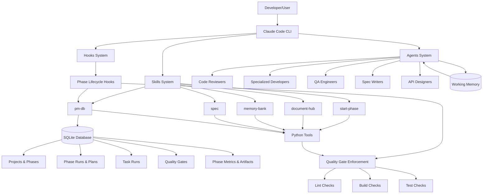
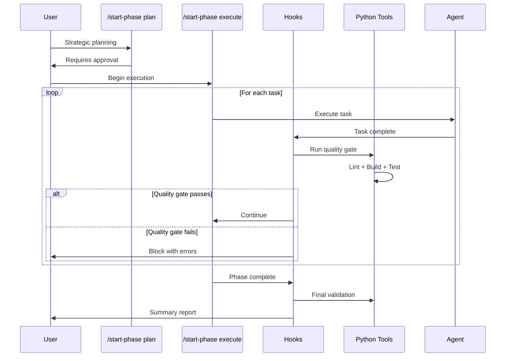
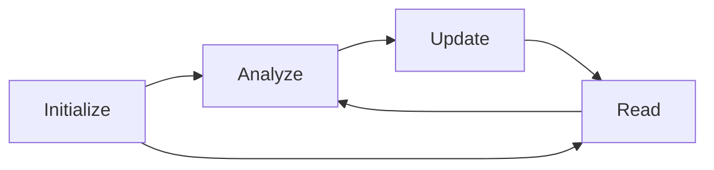
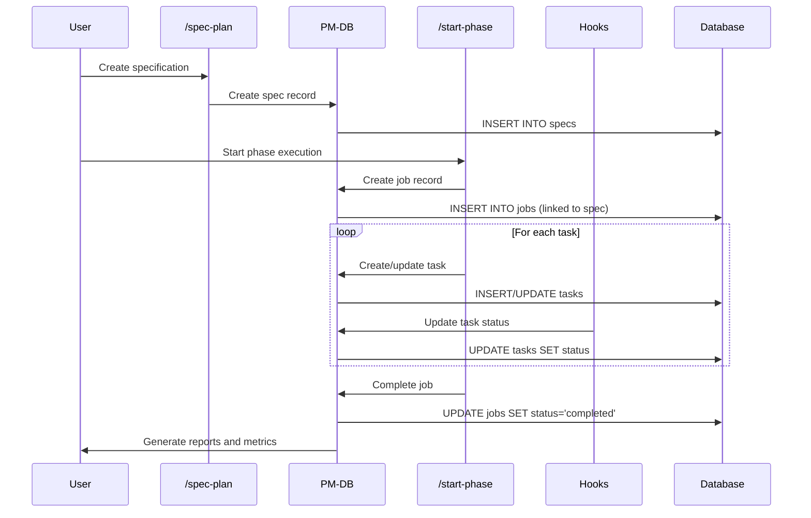
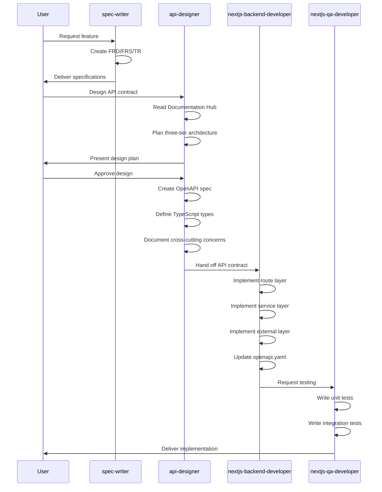

# System Architecture
**Last Updated: 2026-03-09**

## High-Level Overview

This is a **Claude Code development environment** that provides a modular, skill-based architecture for software development workflows. The system extends Claude Code with specialized agents, reusable skills, automated hooks, and quality enforcement tools.

**Primary Purpose:** Enable structured, quality-controlled development workflows through composable skills and automated validation.

## Architecture Diagram



## Key Architectural Decisions

### 1. Modular Skill-Based Design
- **Rationale:** Skills are composable, reusable workflows that can be invoked independently
- **Implementation:** Each skill is a self-contained markdown file with embedded instructions
- **Benefit:** Low coupling, high cohesion, easy to maintain and extend

### 2. Zero-Dependency Python Tools
- **Rationale:** Eliminate external dependencies to ensure portability
- **Implementation:** All tools use Python standard library only
- **Benefit:** No installation friction, works anywhere Python 3.6+ exists

### 3. Hook-Based Automation
- **Rationale:** Enforce quality gates automatically without manual intervention
- **Implementation:** Hooks trigger on specific events (task completion, phase completion)
- **Benefit:** Consistent quality enforcement, prevents shipping broken code

### 4. Agent Personas
- **Rationale:** Different development tasks require different expertise
- **Implementation:** Specialized agent files with specific instructions and knowledge
- **Benefit:** Context-appropriate responses, better code quality

### 5. PM-DB v2: Separation of Planning and Execution
- **Rationale:** Separate "what to do" (plans) from "what was done" (runs) for better tracking and analytics
- **Implementation:** Single SQLite database at `~/.claude/projects.db` with v2 schema:
  - **Projects** contain **Phases**
  - **Phases** have **Phase Plans** (approved blueprints with tasks)
  - **Phase Runs** track actual execution of plans
  - **Task Runs** track individual task execution within phase runs
  - **Quality Gates** record lint/build/test results per task
  - **Phase Metrics** track SLOC changes, duration, and performance
- **Benefit:**
  - Complete audit trail of execution history
  - Better analytics and metrics collection
  - Zero-configuration persistence with ACID compliance
  - No server setup or network dependencies
  - Easy backup/restore (single file)
- **Migration:** Completed 2026-01-30, see `/docs/pm-db-v2-migration-summary.md`

### 6. Agent Context Caching System (Migration 006)
- **Rationale:** Reduce token usage through intelligent file caching across agent invocations
- **Implementation:** SQLite-based cache with SHA-256 hash invalidation in PM-DB
  - **cached_files** - File content cache with hit/miss tracking and priority levels
  - **agent_invocations** - Track every agent execution with file reads and token metrics
  - **checklists** - Quality enforcement with progress tracking and session resumption
  - **checklist_templates** - Versioned, reusable quality checklist templates
  - **cache_statistics** - Performance analytics and token savings aggregation
- **Benefit:**
  - 40-66% token savings in multi-invocation tasks
  - <5ms cache lookups (24x faster than 50ms target)
  - 100% cache hit rate on documentation files (validated)
  - Session persistence across agent invocations
  - Complete traceability (file → invocation → task → phase)
  - Zero performance overhead (<1% of total execution time)
- **Integration:** Deployed in start-phase-plan and start-phase-execute workflows
- **Status:** Production-ready (2026-02-01)

### 7. Team Coordination Pattern
- **Rationale:** Enable parallel task execution for complex features through multi-agent orchestration
- **Implementation:** Team-based workflows via TeamCreate/SendMessage/TaskList tools
  - Team lead spawns specialized agents with shared context
  - Shared task list coordination via PM-DB
  - Explicit message passing between agents (DM and broadcast)
  - Idle state management (normal between turns)
  - Graceful shutdown protocols with approval workflow
- **Benefit:**
  - Parallel execution reduces development time for multi-component features
  - Specialized agents tackle different aspects simultaneously
  - Complete audit trail of team communication and task ownership
  - Session resumption support via PM-DB task tracking
- **Skills:** start-phase-execute-team, remote-control-builder, enhanced feature-new
- **Status:** Production-ready (2026-02-10)

### 8. Agent Standardization and Model Routing
- **Rationale:** Different tasks require different model capabilities. Exploration doesn't need Opus.
- **Implementation:** YAML frontmatter in every agent .md with name, model (claude-opus-4-6 or claude-sonnet-4-6), and tools restriction list
- **Benefit:** 40-60% cost reduction, consistent agent format, principle of least privilege for tools

### 9. Agent Modularization
- **Rationale:** Large agents (41KB security-auditor) consumed too much context budget
- **Implementation:** Split into core (<20KB) + loadable modules in agents/modules/
- **Benefit:** Core loads fast, modules loaded on-demand only when task requires them

### 10. Working Memory for Teams
- **Rationale:** Agents in a team lose context between handoffs
- **Implementation:** Shared markdown file at working-memory/{team-name}.md
- **Benefit:** Cross-agent reasoning continuity, decisions and discoveries persist within team session

## System Components

### Skills Layer
Located in `/home/artsmc/.claude/skills/`

- **start-phase:** Phase management with quality gates (5-part execution workflow)
- **start-phase-execute-team:** Parallel task execution with multi-agent teams
- **document-hub:** Documentation management (initialize, read, analyze, update)
- **memory-bank:** Knowledge storage (initialize, read, sync, update)
- **spec:** Feature specification (plan, review)
- **pm-db:** Project management database for tracking specs, jobs, and tasks with SQLite backend
- **security-quality-assess:** Automated security vulnerability scanning (OWASP Top 10)
- **remote-control-builder:** Build remote control systems using multi-agent workflows

### Agents Layer
Located in `/home/artsmc/.claude/agents/`

Specialized personas for code review, development, and QA across multiple technologies.

**Total Agents:** 19 (all with standardized frontmatter, model routing, and tool restrictions)
- Standardized agents with YAML frontmatter (name, model, tools). 6 on Opus (deep reasoning), 13 on Sonnet (implementation). 3 modularized agents with extractable modules in agents/modules/.

### Hooks Layer
Located in `/home/artsmc/.claude/hooks/`

Automated workflow enforcement:
- **phase-start:** Pre-flight validation
- **task-complete:** Bridge to quality gate
- **quality-gate:** Lint/build/test enforcement
- **phase-complete:** Phase closeout and summary

#### Shadow Git Snapshots
**Location:** `hooks/shadow-snapshot.sh`
**Purpose:** Automatic git checkpoint before Write/Edit operations
- PreToolUse hook creates shadow/{timestamp} branch before file mutations
- Auto-cleanup of branches older than 24h
- Instant rollback via `git checkout shadow/{timestamp} -- path/to/file`

### Tools Layer
Located in `/home/artsmc/.claude/skills/*/scripts/`

Python utilities for validation, quality gates, and analysis:
- `quality_gate.py` - Run lint/build/test checks
- `task_validator.py` - Validate task completion
- `validate_phase.py` - Validate phase structure
- `sloc_tracker.py` - Track source lines of code

### Additional Directories
- `working-memory/` — Cross-agent scratchpad (per-team, session-scoped)
- `agents/modules/` — Extracted deep-reference modules for large agents
- `enhancements/` — Research, specs, and validation reports
- `scripts/` — Health check and utility scripts

## Key Processes

### Phase Execution Workflow (start-phase)



### Documentation Lifecycle (document-hub)



### Project Tracking Workflow (pm-db)



## Data Flow

### Skill Invocation
1. User invokes skill via slash command (e.g., `/start-phase plan`)
2. Claude Code loads skill markdown file
3. Skill instructions guide agent behavior
4. Agent uses tools (Read, Write, Bash, etc.) to execute
5. Helper scripts provide structured data (JSON output)
6. Agent returns results to user

### Hook Triggering
1. User action triggers event (e.g., task completion)
2. Hook system loads relevant hook markdown
3. Hook instructions guide automated workflow
4. Tools validate and enforce quality
5. Hook blocks or allows continuation based on results

## Technology Stack Reference

See `techStack.md` for complete technology listing.

## Module Responsibilities Reference

See `keyPairResponsibility.md` for detailed module breakdown.

## Domain Terms Reference

See `glossary.md` for domain-specific terminology.

## API Design Workflow



**Workflow Position:**
```
spec-writer → api-designer → nextjs-backend-developer → nextjs-qa-developer → code-reviewer
```

**api-designer Responsibilities:**
- Read Documentation Hub files (systemArchitecture.md, openapi.yaml, etc.)
- Design three-tier architecture (route → service → external)
- Create/update OpenAPI specifications
- Define TypeScript type definitions
- Document authentication, rate limiting, caching, versioning
- Provide implementation checklist for backend developer

## Process-Specific Diagrams

For detailed workflow diagrams of specific processes:
- **Specification Lifecycle:** See `specification-lifecycle.md` for complete /spec-plan feedback loop, validation gates, and iteration patterns
- **Phase Execution Lifecycle:** See `phase-execution-lifecycle.md` for complete start-phase workflows including Mode 1 (planning), Mode 2 (execution), quality gates, PM-DB tracking, and parallel execution strategies
