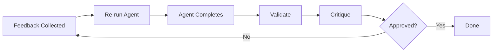

# Spec Feedback Loop Hook

Automatically validates and critiques feature specifications after spec-writer agent completes.

## Purpose

Implements **human-in-loop workflow** for spec generation:
- Automatic validation after agent completes
- Automated quality critique
- User approval required before proceeding
- Easy iteration with feedback

## Trigger

**Event:** `on-task-complete`
**Filter:** Only when `subagent_type: spec-writer`
**When:** Immediately after spec-writer agent finishes

## Behavior

### Step 1: Detect Feature Folder

After spec-writer agent completes, determine the feature folder path:

```
Expected structure: /job-queue/feature-{name}/docs/
Look for most recently created folder in /job-queue/
```

If feature folder not found:
```
⚠️ Could not locate generated specs folder.
Please provide the path: /job-queue/feature-{name}
```

### Step 2: Run Validation

Automatically run validation tool:

```bash
python skills/spec/scripts/validate_spec.py /path/to/feature-folder
```

Parse JSON output:
- `valid`: boolean
- `errors`: list
- `warnings`: list
- `completeness_score`: float

### Step 3: Run Critique

Automatically run critique tool:

```bash
python skills/spec/scripts/critique_plan.py /path/to/feature-folder
```

Parse JSON output:
- `critique_score`: float
- `critical_issues`: list
- `warnings`: list
- `recommendations`: list

### Step 4: Present Results to User

Format findings based on results:

#### Scenario A: Validation Failed (Errors Present)

```
⚠️ Spec Validation Failed

The spec-writer agent has completed, but validation found critical errors:

Critical Errors:
• [error 1]
• [error 2]
• [error 3]

Warnings:
• [warning 1]
• [warning 2]

Completeness Score: [X%]

━━━━━━━━━━━━━━━━━━━━━━━━━━━━━━━━━━━━━━━━

What would you like to do?
1. Let me fix these errors automatically
2. Re-run spec-writer agent with corrections
3. I'll fix them manually and re-validate
```

#### Scenario B: Validation Passed, Quality Issues Found

```
✅ Spec Structure Valid
⚠️ Quality Issues Detected

Validation: PASSED ✅
Completeness: [X%]

Quality Analysis (Score: [Y%]):

Critical Issues:
• [file] - [issue]
  → Suggestion: [fix]

Warnings:
• [file] - [issue]
  → Suggestion: [improvement]

Recommendations:
• [recommendation 1]
• [recommendation 2]

━━━━━━━━━━━━━━━━━━━━━━━━━━━━━━━━━━━━━━━━

The specs are structurally valid but have quality concerns.

What would you like to do?
1. Iterate on these issues (re-run agent with feedback)
2. Proceed with current specs (quality is acceptable)
3. Focus on specific areas (I'll ask what needs work)
```

#### Scenario C: Everything Passed

```
✅ Spec Validation Complete
✅ Quality Critique Complete

Generated Specifications:
📁 /job-queue/feature-{name}/docs/
  ├── FRD.md - Business requirements ✅
  ├── FRS.md - Functional specs ✅
  ├── GS.md - Gherkin scenarios ✅
  ├── TR.md - Technical requirements ✅
  └── task-list.md - Development tasks ✅

Validation: PASSED ✅
Completeness: [X%]
Quality Score: [Y%]

Minor Recommendations:
• [optional improvement 1]
• [optional improvement 2]

━━━━━━━━━━━━━━━━━━━━━━━━━━━━━━━━━━━━━━━━

Specs look great! Are you ready to proceed with development?

Options:
1. Yes, approve these specs ✅
2. I'd like some minor changes
3. Show me a summary of each document
```

### Step 5: Collect User Feedback

Based on user selection:

**Option: Fix Errors Automatically**
- Identify fixable errors (missing files, .gitignore)
- Apply fixes
- Re-run validation
- Present updated results

**Option: Re-run Agent with Feedback**
- Collect specific feedback from user
- Launch spec-writer agent with feedback context
- Wait for completion
- Re-run this hook (validation + critique)

**Option: Manual Fix**
- Instruct user on what needs fixing
- Offer to re-validate when ready
- Exit hook, wait for user

**Option: Focus on Specific Area**
- Ask: "Which area needs work? (requirements/tasks/technical/testability)"
- Run critique with `--focus` flag
- Present focused analysis
- Offer to iterate

**Option: Approve Specs**
- Mark specs as complete
- Suggest next steps:
  ```
  ✅ Specs approved!

  Next steps:
  1. Update Memory Bank: /memorybank sync
  2. Begin development following task-list.md
  3. Reference TR.md for technical details
  4. Use GS.md for test scenarios
  ```
- Exit hook

### Step 6: Iteration Support

If user requests changes, implement iteration loop:



**Iteration Process:**
1. Collect specific feedback
2. Re-launch spec-writer agent:
   ```
   Task tool with subagent_type="spec-writer"

   Prompt: "Update specifications based on feedback:

   Previous specs: /job-queue/feature-{name}/docs/

   User feedback:
   [Specific changes requested]

   Focus on:
   [Documents/areas to update]

   Maintain existing structure, apply requested changes."
   ```
3. Agent completes → Hook triggers again
4. Validate + Critique → Present results
5. Repeat until approved

## Configuration

### Hook Settings

```yaml
enabled: true          # Auto-run after spec-writer
silent: false          # Always show results
filter:
  subagent_type: spec-writer  # Only for spec-writer agent
```

### Disable Hook

If you want to skip automatic validation:

```yaml
enabled: false
```

Then manually run:
```bash
/spec review
```

## Benefits

### Automatic Quality Gate
- No manual validation checklists
- Consistent quality standards
- Early error detection

### Human-in-Loop
- User approval required
- Easy iteration
- Feedback-driven refinement

### Time Savings
- Validation in seconds
- No manual document review
- Automated critique

## Performance

- **Validation:** < 2 seconds
- **Critique:** < 3 seconds
- **Total overhead:** ~5 seconds
- **User experience:** Immediate feedback after agent

## Error Handling

Graceful degradation:
- **Tool script errors:** Show error, offer manual validation
- **Feature folder not found:** Ask user for path
- **Validation fails:** Present errors, offer fixes
- **Hook disabled:** Skip silently

**Never block development workflow.**

## Integration with Skills

This hook works seamlessly with:
- `/spec plan` - Launches spec-writer agent
- `/spec review` - Manual validation/critique trigger
- Hook automatically validates after agent completes

## Example Flow

```
User: /spec plan
→ Research and clarify requirements
→ Launch spec-writer agent
→ Agent generates specs...
→ [Agent completes]
→ ✨ Hook triggers automatically ✨
→ Validation runs
→ Critique runs
→ Results presented to user
→ User approves or iterates
→ Done!
```

## Notes

- **Always runs after spec-writer agent** (if enabled)
- **User approval required** before proceeding
- **Automatic iteration support** with feedback
- **Quality gate** prevents low-quality specs

---

**Estimated overhead:** ~5 seconds (validation + critique)
**User experience:** Immediate, actionable feedback
**Quality impact:** Ensures specs meet standards before development
