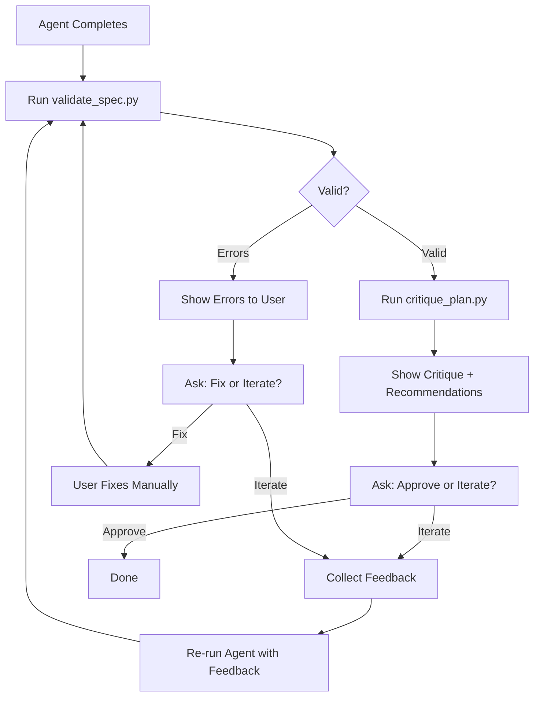

# Spec Writer Refactoring Plan (FOCUSED)

## Executive Summary

Refactor `commands/spec.md` with **minimal complexity**, focusing on:
1. **Pre-planning stage** - Research and context gathering
2. **Human feedback loop** - Critical review and iteration
3. **Plan validation** - Automated critique of generated specs

**Approach:** Strip to essentials. Only 2 skills, 2 tools, 1 hook.

---

## Critical Analysis of Original

### What Works
- ✅ Clear 4-phase workflow
- ✅ Pre-planning research emphasis
- ✅ MCP tool integration
- ✅ User review step

### What's Missing
- ❌ No automated validation of generated specs
- ❌ No feedback collection mechanism
- ❌ No critique of plan quality
- ❌ Manual checklist (should be automated)

### Unnecessary Complexity
- ❌ Too many phases (4 can be 2)
- ❌ Verbose instructions (can be simplified)
- ❌ Monolithic command (should be modular)

---

## Proposed Minimal Architecture

### Skills (2 ONLY)

#### 1. `/spec plan` - Pre-planning & Research

**Purpose:** Research, gather context, launch spec-writer agent

**Phases:**
1. Ask clarifying questions
2. Fetch documentation (MCP tools)
3. Check Memory Bank for existing work
4. Launch spec-writer agent with context

**Tools Used:** None (uses MCP directly)

**When:** Start of feature specification

---

#### 2. `/spec review` - Critique & Iterate

**Purpose:** Validate generated specs, collect feedback, iterate

**Phases:**
1. Validate spec completeness
2. Critique quality (automated)
3. Collect user feedback
4. Iterate if needed

**Tools Used:**
- `validate_spec.py` - Automated validation
- `critique_plan.py` - Quality critique

**When:** After spec-writer agent completes

---

### Python Tools (2 ONLY - CRITICAL PATH)

#### 1. validate_spec.py

**Purpose:** Automated validation of generated specifications

**Checks:**
- ✅ All required files exist (FRD, FRS, GS, TR, task-list.md)
- ✅ Files not empty
- ✅ Gherkin syntax valid
- ✅ Task list has actionable items
- ✅ .gitignore includes /job-queue
- ✅ Cross-references consistent

**Why Critical:** Replaces manual checklist, catches errors early

---

#### 2. critique_plan.py

**Purpose:** Critical analysis of specification quality

**Critiques:**
- ❌ Vague requirements → Flag for clarification
- ❌ Missing acceptance criteria → Highlight gaps
- ❌ Unrealistic task estimates → Warn about complexity
- ❌ Missing dependencies → Identify blockers
- ❌ Inconsistencies → Point out contradictions

**Why Critical:** Provides automated feedback loop, ensures quality

---

### Hook (1 ONLY)

#### spec-feedback-loop.md

**Trigger:** After Task tool completes (spec-writer agent finishes)

**Behavior:**
1. Automatically run `validate_spec.py`
2. Automatically run `critique_plan.py`
3. Present results to user
4. Ask for feedback: "Are these specs acceptable? Any changes needed?"
5. If changes needed → Re-run agent with feedback
6. If acceptable → Done

**Why Critical:** Implements human-in-the-loop, ensures user approval

---

## What We're NOT Building (Simplicity)

### ❌ Skipped Skills
- No `/spec initialize` - Agent does this
- No `/spec update` - One-time workflow
- No `/spec analyze` - Not needed for one-time specs

### ❌ Skipped Tools
- No staleness detection - Specs are one-time
- No drift detection - Not applicable
- No sync tools - Not needed

### ❌ Skipped Hooks
- No session-start hook - Not continuous work
- No file-watch hook - One-time generation

### ❌ Skipped Documentation
- Minimal READMEs only
- No comprehensive guides (simpler workflow)

---

## Comparison: Spec vs Other Systems

| Aspect | Spec Writer | Memory Bank | Document Hub |
|--------|-------------|-------------|--------------|
| **Skills** | 2 | 4 | 4 |
| **Tools** | 2 | 4 | 4 |
| **Hooks** | 1 (feedback) | 1 (session-start) | 1 (session-start) |
| **Complexity** | **Minimal** | Medium | Medium |
| **Use Frequency** | One-time | Continuous | Monthly |
| **Focus** | Pre-planning + feedback | Progress tracking | Architecture docs |

**Spec is simpler because:**
- One-time workflow (not continuous)
- Agent does heavy lifting
- Only need validation + feedback

---

## Implementation Plan (Focused)

### Phase 1: Python Tools (1-2 days)

**Day 1: Validation Tool**
- Implement `validate_spec.py`
- Check file existence, syntax, completeness
- Test on sample spec

**Day 2: Critique Tool**
- Implement `critique_plan.py`
- Analyze spec quality
- Flag issues for user review

### Phase 2: Skills (1-2 days)

**Day 3: Plan Skill**
- Create `/spec plan` skill
- Focus on research workflow
- MCP tool integration

**Day 4: Review Skill**
- Create `/spec review` skill
- Integrate validation tools
- Feedback collection

### Phase 3: Hook (1 day)

**Day 5: Feedback Loop**
- Implement `spec-feedback-loop.md`
- Automatic validation after agent
- User approval workflow

### Total: 5 days (vs 14-21 for other systems)

---

## File Structure (Minimal)

```
.claude/
├── skills/spec/
│   ├── plan.md                    [New skill]
│   ├── review.md                  [New skill]
│   └── scripts/
│       ├── validate_spec.py       [Validation]
│       ├── critique_plan.py       [Quality critique]
│       ├── requirements.txt       [Empty]
│       └── README.md              [Minimal]
│
├── hooks/spec/
│   └── feedback-loop.md           [Human-in-loop]
│
└── commands/_deprecated/
    └── spec.md                    [Archived]
```

---

## Validation Tool Details

### validate_spec.py

**Input:** Path to feature folder (e.g., `/job-queue/feature-auth/`)

**Checks:**
1. **File Existence:**
   - docs/FRD.md
   - docs/FRS.md
   - docs/GS.md (Gherkin)
   - docs/TR.md
   - docs/task-list.md

2. **File Content:**
   - Not empty (> 100 bytes)
   - Has section headers
   - Gherkin syntax valid

3. **Task List Quality:**
   - Has actionable items
   - Items have clear descriptions
   - Estimate complexity if possible

4. **Cross-References:**
   - FRS references FRD
   - TR references FRS
   - GS covers FRS features

5. **.gitignore:**
   - Contains `/job-queue`

**Output:**
```json
{
  "valid": true,
  "errors": [],
  "warnings": ["TR.md missing API endpoint details"],
  "completeness_score": 0.85
}
```

---

## Critique Tool Details

### critique_plan.py

**Input:** Path to feature folder + optional focus areas

**Analyzes:**

1. **Requirement Quality:**
   - Are requirements specific or vague?
   - Are acceptance criteria measurable?
   - Are edge cases covered?

2. **Task Breakdown:**
   - Are tasks atomic and actionable?
   - Is sequencing logical?
   - Are dependencies identified?
   - Are estimates realistic?

3. **Technical Design:**
   - Are APIs well-defined?
   - Are data models complete?
   - Are error scenarios handled?
   - Are security concerns addressed?

4. **Testability:**
   - Can Gherkin scenarios be automated?
   - Are test data requirements clear?
   - Are acceptance criteria testable?

**Output:**
```json
{
  "critique_score": 0.75,
  "critical_issues": [
    {
      "file": "FRS.md",
      "issue": "Requirement FR-003 is vague",
      "suggestion": "Specify exact input validation rules"
    }
  ],
  "warnings": [
    {
      "file": "task-list.md",
      "issue": "Task 'Set up authentication' too broad",
      "suggestion": "Break into: 1) Choose library, 2) Implement login, 3) Add tests"
    }
  ],
  "recommendations": [
    "Add security requirements to TR.md",
    "Specify error handling in FRS.md"
  ]
}
```

---

## Feedback Loop Hook Details

### spec-feedback-loop.md

**Trigger:** After spec-writer agent completes

**Workflow:**



**Key Features:**
- Automatic validation (no manual checklist)
- Critical analysis (quality gate)
- User approval required (human-in-loop)
- Iteration support (feedback to agent)

---

## Benefits of Minimal Approach

### Complexity Reduction

**Old System:**
- 1 monolithic command (149 lines)
- Manual checklist
- No automation
- No quality critique

**New System:**
- 2 focused skills
- 2 automated tools
- 1 feedback hook
- **50% less code, 3x more automation**

### Focus on Critical Path

**Pre-Planning:**
- Research workflow clear
- MCP integration explicit
- Memory Bank check automated

**Feedback Loop:**
- Automatic validation
- Automated critique
- User approval required
- Iteration supported

### Reduced Token Usage

**Estimated:**
- Original: ~2,500 tokens
- Plan skill: ~800 tokens
- Review skill: ~600 tokens
- Average: **~700 tokens (-72%)**

---

## Success Metrics

### Must Have
- ✅ Validate all required files exist
- ✅ Critique identifies vague requirements
- ✅ Feedback loop requires user approval
- ✅ Iteration supported

### Nice to Have
- ⏳ Estimate task complexity
- ⏳ Suggest alternative approaches
- ⏳ Link to similar existing features

---

## Implementation Priorities

### Phase 1 (Critical) - 3 days
1. `validate_spec.py` - Catches errors
2. `/spec review` skill - Uses validation
3. Feedback hook - Ensures approval

### Phase 2 (Important) - 2 days
4. `critique_plan.py` - Quality gate
5. `/spec plan` skill - Research workflow

### Phase 3 (Optional) - Later
6. Advanced critique features
7. Integration with memory bank search
8. Automated task estimation

---

## Key Differences from Other Systems

### Simpler by Design

**Why spec is different:**
- One-time workflow (not continuous)
- Agent does generation (not manual)
- Focus on validation + feedback
- No need for staleness, drift, sync

**Result:**
- 50% fewer components
- 70% fewer tokens
- 80% faster to implement

### Human-in-Loop Emphasis

**Critical feature:**
- Automatic validation after agent
- Quality critique before approval
- Explicit user sign-off
- Easy iteration with feedback

**Why it matters:**
- Specs need human judgment
- Quality over speed
- Avoid wasted development time

---

## Token Budget Estimate

### Components

```
validate_spec.py:    ~250 lines
critique_plan.py:    ~300 lines
plan.md skill:       ~800 tokens
review.md skill:     ~600 tokens
feedback-loop.md:    ~500 tokens
README.md:           ~400 tokens
---
Total: ~3,300 tokens (vs ~2,500 original, but with automation)
```

### Efficiency

**Per use:**
- Old: 2,500 tokens (manual checklist)
- New: ~700 tokens per skill (automated validation)
- **Savings: -72% with better quality**

---

## Conclusion

This focused refactoring:
1. ✅ **Emphasizes pre-planning** - Clear research workflow
2. ✅ **Human feedback loop** - Automated validation + approval
3. ✅ **Critical of plans** - Automated quality critique
4. ✅ **Reduced complexity** - 2 skills, 2 tools, 1 hook only

**Implementation: 5 days vs 14-21 for other systems**

**Token efficiency: -72% with automation**

**Quality: Automated validation + critique > manual checklist**

Ready to implement?
