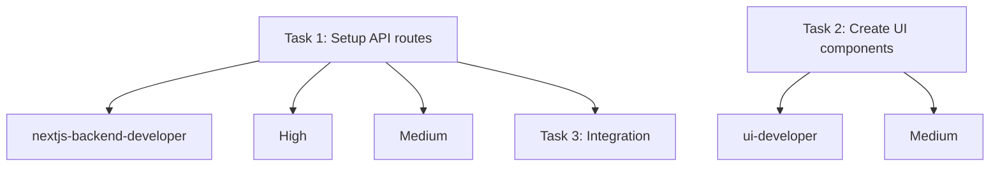
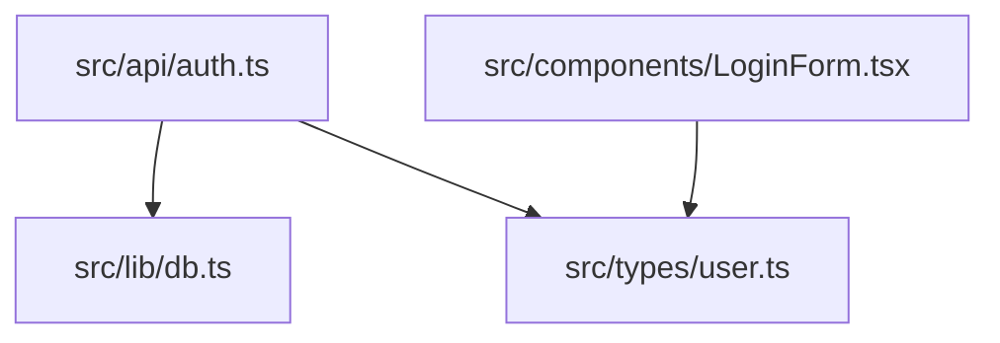

# Start-Phase Refactoring Plan: COMPREHENSIVE

## Executive Summary

Refactor `commands/start-phase.md` into a **comprehensive phase management system** with:
1. **Clear Mode 1 (Plan) vs Mode 2 (Execute) separation**
2. **Mode 2 broken into Part 1-5** with concrete deliverables
3. **Quality gates between tasks** (lint/build/review mandatory)
4. **Git commits after each task** with checkpoints
5. **Code reviews between tasks** (not just end)
6. **Comprehensive planning folders** (task-updates, agent-delegation, phase-structure)

**Approach:** Build a structured, quality-focused system with automation and checkpoints.

---

## Critical Requirements from User

### Mode 1 (Plan Mode) - Human-in-the-loop
- Strategic gate before execution
- Refine task list for parallelism
- Force incremental builds
- Human approval required
- **NO directories, commits, or code** - only planning

### Mode 2 (Execute Mode) - 5 Parts + Quality Gates

**Part 1:** Finalize Plan + Create Directories
**Part 2:** Detailed Planning (3 docs: task-delegation, sub-agent-plan, system-changes)
**Part 3:** Parallel Task Execution
**Part 3.5:** Quality Gate (NEW - between tasks)
**Part 4:** Task Updates + Commits + Review
**Part 5:** Phase Closeout (NEW - completion summary)

### Quality Gate Requirements (Part 3.5)

**Between EVERY task:**
1. Mid-task checkpoints (for long tasks)
2. Lint + build must pass (mandatory)
3. Code review (per task, not just end)
4. Task update file
5. Git commit (only after gate passes)

**Hard rule:** Cannot start next task until lint/build green + review complete.

---

## Proposed Architecture

### Skills (2 ONLY - Keep it Simple)

#### 1. `/start-phase plan [phase_name] [task_list_file]`

**Purpose:** Mode 1 - Strategic refinement + human approval

**Workflow:**
1. Read task list, docs, memory bank
2. Analyze for parallelism + incremental builds
3. Propose refined plan
4. Await approval
5. Do NOT proceed to execution

**Output:** Refined, approved task list

---

#### 2. `/start-phase execute [phase_name] [task_list_file]`

**Purpose:** Mode 2 - Structured execution with quality gates

**Workflow:**
- Part 1: Finalize + directories
- Part 2: Create 3 planning docs
- Part 3: Execute tasks
- Part 3.5: Quality gate (per task)
- Part 4: Updates + commits
- Part 5: Closeout

**Output:** Completed phase with quality checks

---

### Python Tools (4 CRITICAL)

#### 1. validate_phase.py

**Purpose:** Validate phase structure and planning files

**Checks:**
- Required directories exist
- Planning files present (task-delegation.md, sub-agent-plan.md, system-changes.md)
- Task updates created for completed tasks
- Git commits match task completions

**Output:** JSON validation report

---

#### 2. quality_gate.py

**Purpose:** Run quality checks (lint/build/test)

**Checks:**
- Lint passes (npm run lint or equivalent)
- Build passes (npm run build or equivalent)
- Optional: Tests pass (npm test)

**Output:** JSON with pass/fail + errors

---

#### 3. sloc_tracker.py

**Purpose:** Track SLOC changes per file

**Features:**
- Baseline SLOC capture
- Per-file tracking
- Delta calculation
- Update system-changes.md table

**Output:** JSON with SLOC data

---

#### 4. task_validator.py

**Purpose:** Validate task completion requirements

**Checks:**
- Task update file exists
- Code review file exists
- Quality gate passed
- Git commit created
- Checklist completed

**Output:** JSON with validation status

---

### Hook (1 CRITICAL)

#### quality-gate.md

**Trigger:** `on-task-complete` or manual `/quality-gate`

**Workflow:**
1. Run quality_gate.py (lint/build)
2. Prompt for code review
3. Run task_validator.py
4. Allow/block next task

**Purpose:** Enforce quality between tasks

---

## File Structure

```
.claude/
├── skills/start-phase/
│   ├── README.md
│   ├── plan.md                    [Mode 1 skill]
│   ├── execute.md                 [Mode 2 skill]
│   └── scripts/
│       ├── validate_phase.py
│       ├── quality_gate.py
│       ├── sloc_tracker.py
│       ├── task_validator.py
│       ├── requirements.txt       [Empty - no deps]
│       └── README.md
│
├── hooks/start-phase/
│   ├── quality-gate.md            [Between-task gate]
│   └── README.md
│
└── commands/_deprecated/
    └── start-phase.md             [Original]
```

---

## Mode 1 Skill: Detailed Spec

### `/start-phase plan [phase_name] [task_list_file]`

**Frontmatter:**
```yaml
name: start-phase-plan
description: Mode 1 - Strategic refinement with human approval
args:
  phase_name:
    type: string
    description: Phase name (e.g., "prototype-build")
    required: true
  task_list_file:
    type: string
    description: Path to task list markdown file
    required: true
```

**Workflow:**

1. **Acknowledge Mode 1**
   - "Entering Mode 1 (Plan Mode) for phase: {phase_name}"

2. **Read Context**
   - Read task_list_file
   - Read Documentation Hub ({{input_folder}}/docs)
   - Read Memory Bank

3. **Strategic Analysis**
   - Question complexity (propose prototype first)
   - Identify parallelism opportunities
   - Force incremental builds
   - Break down dependencies

4. **Propose Refined Plan**
   - Present revised task list
   - Highlight changes:
     - Tasks made parallel
     - Incremental build order
     - Simplified scope
     - Clear dependencies

5. **Await Approval**
   - Ask: "Do you approve this refined plan?"
   - Options:
     - Approve → Ready for `/start-phase execute`
     - Revise → Iterate on plan
     - Reject → Stop

**Important:** NO execution in Mode 1. Only planning and human approval.

---

## Mode 2 Skill: Detailed Spec

### `/start-phase execute [phase_name] [task_list_file]`

**Frontmatter:**
```yaml
name: start-phase-execute
description: Mode 2 - Structured execution with quality gates
args:
  phase_name:
    type: string
    description: Phase name
    required: true
  task_list_file:
    type: string
    description: Path to approved task list
    required: true
```

**Workflow:**

### Part 1: Finalize Plan + Create Directories

1. **Update Task List**
   - Write approved plan to task_list_file
   - Announce: "Task list finalized"

2. **Create Directory Structure**
   ```bash
   mkdir -p "{{input_folder}}/planning/task-updates"
   mkdir -p "{{input_folder}}/planning/agent-delegation"
   mkdir -p "{{input_folder}}/planning/phase-structure"
   mkdir -p "{{input_folder}}/planning/code-reviews"
   ```

3. **Validate**
   - Run validate_phase.py
   - Confirm directories created

---

### Part 2: Detailed Planning & Analysis

**2.1 Task Delegation**

Create `{{input_folder}}/planning/agent-delegation/task-delegation.md`:

**Required content:**
- Mermaid `graph TD` showing:
  - Each task as a node
  - Agent assignment per task
  - Priority (high/medium/low)
  - Difficulty (easy/medium/hard)
  - Dependencies (arrows)

**Example:**


---

**2.2 Sub-Agent Parallel Plan**

Create `{{input_folder}}/planning/agent-delegation/sub-agent-plan.md`:

**Required content:**
- Explicit parallel execution instruction
- Must include phrase: **"Spawn SUBAGENT WORKERS IN PARALLEL"**
- Breakdown of which tasks can run concurrently
- Dependencies that block parallelism

**Example:**
```markdown
## Parallel Execution Strategy

### Wave 1 (Independent - Run in Parallel)
**Spawn SUBAGENT WORKERS IN PARALLEL to complete these tasks:**
- Task 1: Setup API routes (nextjs-backend-developer)
- Task 2: Create UI components (ui-developer)
- Task 3: Write tests (qa-engineer)

### Wave 2 (Depends on Wave 1)
- Task 4: Integration (requires Tasks 1 & 2)
```

---

**2.3 System Changes Analysis**

Create `{{input_folder}}/planning/phase-structure/system-changes.md`:

**Required content:**

1. **Mermaid flowchart** of impacted files:


2. **SLOC baseline table:**
```markdown
| File | Baseline SLOC | Current SLOC | Delta |
|------|---------------|--------------|-------|
| src/api/auth.ts | 0 (new) | TBD | TBD |
| src/lib/db.ts | 150 | TBD | TBD |
```

**Use sloc_tracker.py to populate baseline.**

---

### Part 3: Parallel Task Execution

**For each task:**

1. **Announce Task Start**
   - "Starting Task X: {task_name}"
   - "Adopting persona: {agent_name}"

2. **Execute Task**
   - Follow agent persona
   - Make changes
   - **Mid-task checkpoints** (for tasks >30min):
     - Create checkpoint commit
     - Format: `checkpoint: {task-name} - {note}`
     - Must compile (if applicable)

3. **Do NOT mark complete yet** - go to Part 3.5 (Quality Gate)

---

### Part 3.5: Quality Gate (MANDATORY BETWEEN TASKS)

**After task execution, BEFORE marking complete:**

#### Step A: Run Quality Checks

```bash
python skills/start-phase/scripts/quality_gate.py {{input_folder}}
```

**Must pass:**
- Lint: `npm run lint` (or equivalent)
- Build: `npm run build` (or equivalent)
- Optional: Tests

**Hard rule:** Task CANNOT proceed if lint or build fails.

---

#### Step B: Code Review (Per Task)

**Adopt code_reviewer persona:**

Create `{{input_folder}}/planning/code-reviews/{task-name}.md`:

**Required content:**
- Summary (2-5 bullets)
- Correctness check
- Type safety check
- Convention consistency
- Issues found
- Fixes applied
- Verdict: ✅ Approved / ⚠️ Needs follow-up

---

#### Step C: Task Validator

```bash
python skills/start-phase/scripts/task_validator.py {{input_folder}} {task-name}
```

**Checks:**
- Quality gate passed
- Code review exists
- Task update file ready

---

#### Step D: Task Update + Git Commit

Create `{{input_folder}}/planning/task-updates/{task-name}.md`:

**Required content:**
- What changed
- Files touched
- How to verify
- Decisions made
- Next steps (if any)
- **Checklist:**
  - [ ] Lint passed
  - [ ] Build passed
  - [ ] Review completed
  - [ ] Commit created

**Git commit:**
```bash
git add .
git commit -m "Completed task: {task-name} during phase {phase}"
```

---

**Enforcement:** Cannot start next task until Part 3.5 completes successfully.

---

### Part 4: Final Review (After ALL Tasks)

**Once all tasks complete:**

1. **Switch to code_reviewer persona**
2. **Comprehensive review** of entire phase
3. **Create {{input_folder}}/code-review.md**:
   - Summary of all changes
   - Risk areas
   - Test coverage notes
   - Follow-up tasks

---

### Part 5: Phase Closeout (NEW)

**Create closeout documents:**

#### 5.1 Phase Summary

Create `{{input_folder}}/planning/phase-structure/phase-summary.md`:

**Required content:**
- What was delivered
- What was deferred
- Notable decisions
- Known risks
- Quality metrics:
  - Tasks completed
  - Quality gates passed
  - Total commits
  - SLOC delta

---

#### 5.2 Next Phase Candidates

Create `{{input_folder}}/planning/phase-structure/next-phase-candidates.md`:

**Required content:**
- Backlog items discovered
- Technical debt notes
- Improvements needed
- Follow-up tasks

---

#### 5.3 SLOC Delta (Final)

Run `sloc_tracker.py` final update:

Update `system-changes.md` with:
- Final SLOC per file
- Total delta
- Net change analysis

---

## Quality Gate Hook: Detailed Spec

### `hooks/start-phase/quality-gate.md`

**Trigger:** After each task completes (or manual)

**Workflow:**

1. **Detect task completion**
   - Listen for task complete signal
   - Or manual: `/quality-gate {task-name}`

2. **Run quality_gate.py**
   - Check lint
   - Check build
   - Report results

3. **If checks fail:**
   - Present errors
   - Block next task
   - Prompt: "Fix issues before proceeding"

4. **If checks pass:**
   - Prompt for code review
   - Run task_validator.py
   - Allow next task

5. **Enforce:**
   - "No next task until gate passes"

---

## Python Tools: Implementation Details

### 1. validate_phase.py

```python
#!/usr/bin/env python3
"""Validate phase structure and planning files."""

import json
import sys
from pathlib import Path

def validate_phase(input_folder: Path) -> dict:
    """Validate phase directory structure."""

    errors = []
    warnings = []

    # Check directories
    required_dirs = [
        "planning/task-updates",
        "planning/agent-delegation",
        "planning/phase-structure",
        "planning/code-reviews"
    ]

    for dir_path in required_dirs:
        full_path = input_folder / dir_path
        if not full_path.exists():
            errors.append(f"Missing directory: {dir_path}")

    # Check planning files
    planning_files = [
        "planning/agent-delegation/task-delegation.md",
        "planning/agent-delegation/sub-agent-plan.md",
        "planning/phase-structure/system-changes.md"
    ]

    for file_path in planning_files:
        full_path = input_folder / file_path
        if not full_path.exists():
            warnings.append(f"Missing planning file: {file_path}")

    return {
        "valid": len(errors) == 0,
        "errors": errors,
        "warnings": warnings
    }
```

---

### 2. quality_gate.py

```python
#!/usr/bin/env python3
"""Run quality checks: lint, build, test."""

import json
import subprocess
import sys
from pathlib import Path

def run_quality_checks(project_path: Path) -> dict:
    """Run lint, build, and optionally test."""

    results = {
        "lint": {"passed": False, "output": ""},
        "build": {"passed": False, "output": ""},
        "test": {"passed": None, "output": ""}
    }

    # Run lint
    try:
        result = subprocess.run(
            ["npm", "run", "lint"],
            cwd=project_path,
            capture_output=True,
            text=True,
            timeout=120
        )
        results["lint"]["passed"] = result.returncode == 0
        results["lint"]["output"] = result.stdout + result.stderr
    except Exception as e:
        results["lint"]["output"] = str(e)

    # Run build
    try:
        result = subprocess.run(
            ["npm", "run", "build"],
            cwd=project_path,
            capture_output=True,
            text=True,
            timeout=300
        )
        results["build"]["passed"] = result.returncode == 0
        results["build"]["output"] = result.stdout + result.stderr
    except Exception as e:
        results["build"]["output"] = str(e)

    # Optional: Run test
    # (Can be enabled per project)

    all_passed = results["lint"]["passed"] and results["build"]["passed"]

    return {
        "passed": all_passed,
        "checks": results
    }
```

---

### 3. sloc_tracker.py

```python
#!/usr/bin/env python3
"""Track SLOC changes per file."""

import json
import sys
from pathlib import Path

def count_sloc(file_path: Path) -> int:
    """Count source lines of code (non-blank, non-comment)."""
    try:
        lines = file_path.read_text(encoding='utf-8').splitlines()
        sloc = sum(1 for line in lines if line.strip() and not line.strip().startswith(('//','#','/*','*')))
        return sloc
    except:
        return 0

def track_sloc(files: list, baseline_file: Path) -> dict:
    """Track SLOC for list of files."""

    # Load baseline if exists
    baseline = {}
    if baseline_file.exists():
        baseline = json.loads(baseline_file.read_text())

    current = {}
    for file_path in files:
        path = Path(file_path)
        if path.exists():
            current[str(file_path)] = count_sloc(path)

    # Calculate deltas
    deltas = {}
    for file_path, sloc in current.items():
        baseline_sloc = baseline.get(file_path, 0)
        deltas[file_path] = {
            "baseline": baseline_sloc,
            "current": sloc,
            "delta": sloc - baseline_sloc
        }

    return {
        "deltas": deltas,
        "total_delta": sum(d["delta"] for d in deltas.values())
    }
```

---

### 4. task_validator.py

```python
#!/usr/bin/env python3
"""Validate task completion requirements."""

import json
import sys
from pathlib import Path

def validate_task_completion(input_folder: Path, task_name: str) -> dict:
    """Validate task has all required artifacts."""

    errors = []
    warnings = []

    # Check task update file
    task_update = input_folder / f"planning/task-updates/{task_name}.md"
    if not task_update.exists():
        errors.append(f"Missing task update: {task_name}.md")

    # Check code review file
    code_review = input_folder / f"planning/code-reviews/{task_name}.md"
    if not code_review.exists():
        errors.append(f"Missing code review: {task_name}.md")

    # Check for checklist completion (if task update exists)
    if task_update.exists():
        content = task_update.read_text()
        required_checks = [
            "- [x] Lint passed",
            "- [x] Build passed",
            "- [x] Review completed",
            "- [x] Commit created"
        ]

        for check in required_checks:
            if check not in content:
                warnings.append(f"Checklist incomplete in {task_name}.md")
                break

    return {
        "valid": len(errors) == 0,
        "errors": errors,
        "warnings": warnings
    }
```

---

## Token Efficiency Considerations

### Original vs New

**Original:**
- Single monolithic command: ~3,200 bytes (~800 tokens)

**New System:**
- Plan skill: ~3,500 bytes (~875 tokens)
- Execute skill: ~7,000 bytes (~1,750 tokens)
- Total: ~10,500 bytes (~2,625 tokens)

**Per invocation:**
- Mode 1 (plan): +75 tokens (+9%)
- Mode 2 (execute): +950 tokens (+119%)

**BUT:**
- Mode 2 includes 5 parts (not 4)
- Quality gates between tasks (new)
- Code reviews per task (new)
- Comprehensive validation (new)
- SLOC tracking (new)
- Phase closeout (new)

**Trade-off:** More tokens BUT much more structure, quality, and automation.

---

## Implementation Priority

### Phase 1 (Critical) - 3 days
1. `quality_gate.py` - Quality checks
2. `task_validator.py` - Task validation
3. `/start-phase plan` skill - Mode 1

### Phase 2 (Important) - 3 days
4. `validate_phase.py` - Phase validation
5. `sloc_tracker.py` - SLOC tracking
6. `/start-phase execute` skill - Mode 2 (Part 1-5)

### Phase 3 (Enhancement) - 1 day
7. `quality-gate.md` hook
8. Documentation

**Total: 7 days**

---

## Success Metrics

### Must Have
- ✅ Mode 1 forces human approval
- ✅ Quality gate blocks bad code
- ✅ Lint + build must pass between tasks
- ✅ Code reviews per task (not just end)
- ✅ Git commits after each task
- ✅ Comprehensive planning structure

### Nice to Have
- ⏳ Automatic SLOC tracking
- ⏳ Parallel agent execution
- ⏳ Quality metrics dashboard

---

## Key Differences from Other Systems

### Why start-phase is MORE complex:

1. **Two modes** (plan + execute)
2. **Five parts** in execute mode
3. **Quality gates** between tasks
4. **Per-task code reviews** (not just end)
5. **Structured planning** (3 required docs)
6. **SLOC tracking** (technical complexity)

**Result:** Most comprehensive system, but justified by phase management needs.

---

## Conclusion

This refactoring:
1. ✅ **Clear Mode 1 vs Mode 2** - Separation enforced
2. ✅ **Part 1-5 structure** - Concrete deliverables
3. ✅ **Quality gates** - Mandatory between tasks
4. ✅ **Git commits** - After each task
5. ✅ **Code reviews** - Per task, not just end
6. ✅ **Comprehensive planning** - All required folders/files

**Implementation: 7 days**

**Complexity: HIGH (justified by requirements)**

**Quality: MAXIMUM (gates + reviews + validation)**

Ready to implement?
