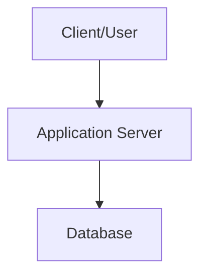

# System Architecture

## High-Level Overview

[Brief description of what this project does]

## Architecture Diagram

## Database Schema

[If applicable, add ER diagram or schema description]

## Key Processes

[Describe major workflows]
