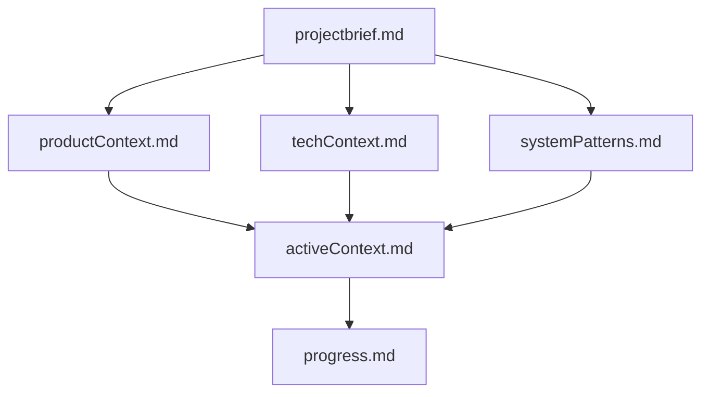

# /memory-bank-initialize

> Bootstrap a new project's Memory Bank by creating the six core files with templates and gathering initial project information from the user. Also the entry point to initialize/set up project documentation in a new or freshly cloned repo — including bootstrapping BOTH Brain systems (Memory Bank + Document Hub) at once.

## What it does

Creates the `memory-bank/` directory in a project with its six core files from starter templates, prompts for initial project details, and validates the result with `validate_memorybank.py`. It is also the entry point for bootstrapping both Brain systems in one pass (formerly `/documentation-start`): run this skill, then `/document-hub-initialize`, skipping whichever system already exists.

```
memory-bank/
├── projectbrief.md         # Foundation (goals, scope)
├── productContext.md       # User experience & vision
├── techContext.md          # Technologies & setup
├── systemPatterns.md       # Architecture & patterns
├── activeContext.md        # Current work focus ⚡
└── progress.md             # Status & learnings ⚡
```

**⚡ = updated frequently** (see `/memory-bank-update --quick`)

## When it triggers

- "initialize the memory bank"
- "set up project documentation systems for this new repo — memory bank plus document hub"
- "bootstrap both brain systems for the freshly cloned repo"
- "this project has no docs yet — initialize the documentation from scratch"
- "/documentation-start" (archived skill; routes here)

## Usage

```
/memory-bank-initialize
```

No flags. Formerly also covered by `/documentation-start` (archived) for the both-systems bootstrap — that flow now lives in this skill's "Bootstrapping both systems" section.

## Context cost

Description always in context (~320 chars); SKILL.md body loads on trigger (~1.8k chars); `references/templates/*` (six per-file templates) load on demand as each Memory Bank file is created.

## Files

| Path | Purpose |
|---|---|
| `SKILL.md` | Workflow: check-exists → create dir → six files → gather info → validate |
| `references/templates/*.md` | Starter templates for all six Memory Bank files |
| `scripts/validate_memorybank.py` | Structure validation (used by this skill) |
| `scripts/detect_stale.py`, `scripts/extract_todos.py`, `scripts/sync_active.py` | Shared with read/update (memory-bank-update symlinks this scripts dir) |
| `scripts/README.md` | Full tool documentation |
| `evals/documentation-start-routing-eval.json` | Routing eval for the merged /documentation-start triggers |

All Python tools are stdlib-only — no `pip install` needed.

## File hierarchy

Files are read in dependency order across all memory-bank skills:


```mermaid
flowchart TD
    PB[projectbrief.md] --> PC[productContext.md]
    PB --> TC[techContext.md]
    PB --> SP[systemPatterns.md]
    PC --> AC[activeContext.md]
    TC --> AC
    SP --> AC
    AC --> P[progress.md]
```

A session-start hook (`hooks/memory-bank/`) loads the whole Memory Bank at session start for immediate context.

## Related skills

- `/memory-bank-read` — summarize current state ("where did I leave off")
- `/memory-bank-update` — full 6-file review, or `--quick` for a 2-file save (formerly `/memory-bank-sync`)
- `/document-hub-initialize` — the other Brain system (4 flat files in `cline-docs/`, architecture-focused, updated on major changes; Memory Bank is progress/context-focused and updated after every task)
