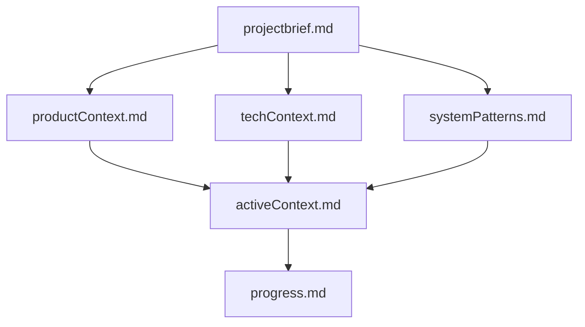

# Memory Bank Skills

Project memory management system. Maintains 6 core files documenting project context, progress, and decisions.

## Quick Start

```bash
# Initialize new project
/memorybank initialize

# Update after major changes
/memorybank update

# Quick sync after tasks (NEW!)
/memorybank sync

# View current state
/memorybank read
```

---

## The Memory Bank

```
memory-bank/
├── projectbrief.md         # Foundation (goals, scope)
├── productContext.md       # User experience & vision
├── techContext.md          # Technologies & setup
├── systemPatterns.md       # Architecture & patterns
├── activeContext.md        # Current work focus ⚡
└── progress.md             # Status & learnings ⚡
```

**⚡ = Updated frequently**

---

## Skills

### 1. `/memorybank initialize`

**Purpose:** Bootstrap new project

**Creates:** All 6 files with templates
**Tools:** `validate_memorybank.py`
**When:** Start of new project

---

### 2. `/memorybank update`

**Purpose:** Comprehensive review and update

**Updates:** All 6 files
**Tools:** `validate_memorybank.py`, `detect_stale.py`, `extract_todos.py`
**When:** After significant changes, architectural decisions

**Workflow:**
1. Validate structure
2. Detect staleness
3. Read all files
4. Extract TODOs
5. Propose updates
6. Apply after approval

---

### 3. `/memorybank sync` ⭐ NEW!

**Purpose:** Fast sync of active files only

**Updates:** activeContext.md + progress.md only
**Tools:** `sync_active.py`, `extract_todos.py`
**When:** After each task completion

**Why it exists:** Memory bank updates frequently, but full `/memorybank update` is slow.
Sync is 3x faster and perfect for post-task updates.

**Speed:** ~2 seconds vs ~5+ for full update

---

### 4. `/memorybank read`

**Purpose:** Quick overview

**Reads:** All 6 files in hierarchical order
**Tools:** `validate_memorybank.py`, `detect_stale.py`
**When:** Start of work, periodic checks

---

## Python Tools

### validate_memorybank.py

**Purpose:** Structure validation + staleness detection

**Checks:**
- All 6 files exist
- File hierarchy consistency
- Staleness (last modified)
- Cross-file references

**Output:**
```json
{
  "valid": true,
  "warnings": [...],
  "last_updated": {
    "activeContext.md": 3,
    "progress.md": 5
  }
}
```

---

### detect_stale.py

**Purpose:** Find outdated information

**Detects:**
- Stale files (not updated recently)
- Tech contradictions (techContext vs dependencies)
- Completed items still marked in-progress
- Cross-file inconsistencies

**Output:**
```json
{
  "staleness_score": 0.23,
  "status": "needs_attention",
  "stale_files": [...],
  "recommendations": [...]
}
```

---

### extract_todos.py

**Purpose:** Extract action items from code and files

**Sources:**
- TODO comments in code
- Uncompleted items in progress.md
- Action items in activeContext.md

**Output:**
```json
{
  "next_steps": [
    {
      "task": "Implement authentication API",
      "priority": "high",
      "source": "activeContext.md"
    }
  ],
  "recently_completed": [...]
}
```

---

### sync_active.py

**Purpose:** Fast sync of dynamic files

**Updates:**
- activeContext.md (focus, blockers, learnings)
- progress.md (completed items)

**Input:** JSON with completed, new_focus, learnings, blockers

**Output:**
```json
{
  "updated": {
    "activeContext.md": true,
    "progress.md": true
  },
  "changes": {...}
}
```

---

## Session-Start Hook ✅

**Automatic Context Loading**

Hook loads entire Memory Bank at session start:
- Reads all 6 files silently
- Validates structure
- Provides immediate context
- Implements "Brain" persona

**Performance:** ~3 seconds overhead

See `hooks/memory-bank/README.md`

---

## Tool Summary Matrix

| Tool | initialize | update | read | sync |
|------|:----------:|:------:|:----:|:----:|
| **validate_memorybank.py** | ✅ | ✅ (2x) | ✅ | ❌ |
| **detect_stale.py** | ❌ | ✅ | ✅ | ❌ |
| **extract_todos.py** | ❌ | ✅ | ❌ | ✅ |
| **sync_active.py** | ❌ | ❌ | ❌ | ✅ |

---

## Comparison: Memory Bank vs Document Hub

| Aspect | Memory Bank | Document Hub |
|--------|-------------|--------------|
| **Files** | 6 (hierarchical) | 4 (flat) |
| **Focus** | Progress & context | Architecture |
| **Updates** | After every task | Monthly/major changes |
| **Dynamic files** | activeContext + progress | None |
| **Unique skill** | `/memorybank sync` | `/document-hub analyze` |

---

## File Hierarchy



Files must be read in dependency order.

---

## Zero Dependencies

All Python tools use standard library only:
- `json`, `sys`, `re`, `pathlib`, `datetime`, `os`

No `pip install` needed!

---

## Status

**Implementation:** ✅ Complete
- 4 skills implemented
- 4 Python tools implemented
- Session-start hook implemented
- Zero dependencies
- Following Anthropic pattern

**Ready for production use.**

---

See `scripts/README.md` for complete tool documentation.
