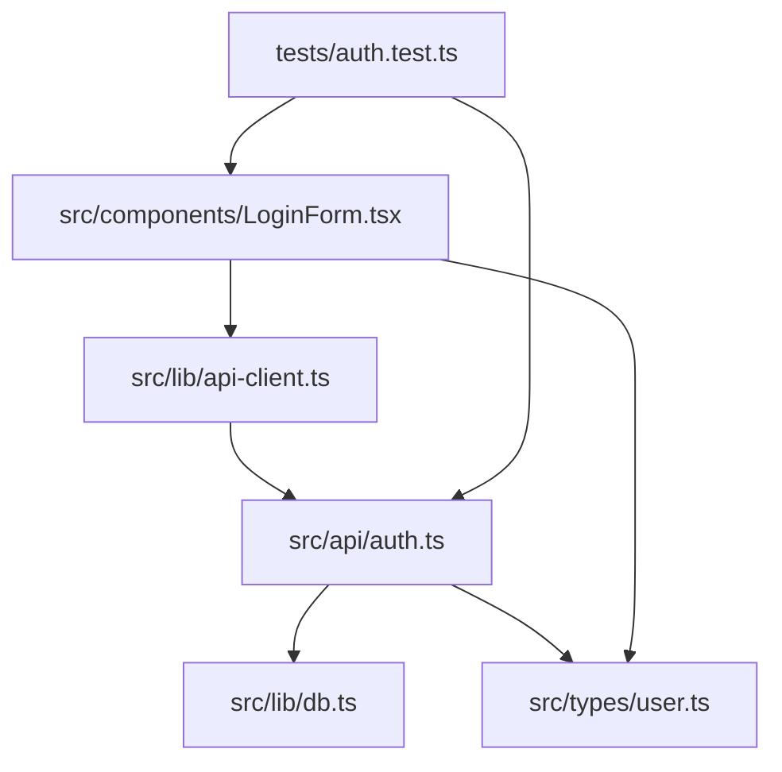

# Start-Phase: Mode 2 (Execute) with PM-DB Tracking

Structured execution with quality gates enforcement and automatic project management database tracking.

## Usage

```bash
# Basic execution
/start-phase execute /path/to/task-list.md

# With extra instructions
/start-phase execute /path/to/task-list.md "Focus on type safety and add extra error handling"

# With specific spec ID for tracking
/start-phase execute /path/to/task-list.md "" 4
```

**Example:**
```bash
/start-phase execute ./job-queue/prototype-build/tasks.md
/start-phase execute ./job-queue/auth/tasks.md "Use bcrypt for passwords, add rate limiting"
/start-phase execute ./job-queue/feature-dynamodb-profile-schema/tasks.md "" 4
```

## Purpose

Mode 2 implements the complete execution workflow:
- Part 1: Finalize plan + create directories + **initialize pm-db job**
- Part 2: Detailed planning (3 required docs)
- Part 3: Execute tasks with agent personas + **pm-db task tracking**
- Part 3.5: Quality gates (automatic via hook) + **code review tracking**
- Part 4: Task updates + commits
- Part 5: Phase closeout + summary + **complete pm-db job**

## Critical: Path Management

**NEVER lose these paths during execution:**

```
Task list file: /path/to/folder/tasks.md

Derived paths (PERMANENT for this phase):
• input_folder: /path/to/folder
• planning_folder: /path/to/folder/planning

All artifacts go in planning_folder!
```

---

## Part 1: Finalize Plan & Create Directories

### Step 1.1: Extract Folder Locations

```
━━━━━━━━━━━━━━━━━━━━━━━━━━━━━━━━━━━━━━━━
🚀 Mode 2: Execute
━━━━━━━━━━━━━━━━━━━━━━━━━━━━━━━━━━━━━━━━

Task list: {task_list_file}
Input folder: {input_folder}
Planning folder: {planning_folder}

Extra instructions: {extra_instructions or "None"}
Spec ID: {spec_id or "Auto-detect"}

━━━━━━━━━━━━━━━━━━━━━━━━━━━━━━━━━━━━━━━━

Part 1: Finalizing plan and creating structure...
```

**Store these permanently:**
```
input_folder = directory containing {task_list_file}
planning_folder = {input_folder}/planning
phase_name = extracted from task list or folder name
```

---

### Step 1.2: Read Approved Task List

```bash
Read {task_list_file}
```

Extract:
- Phase name
- All tasks
- Parallel waves (if defined)
- Dependencies

---

### Step 1.2b: Initialize PM-DB Job Tracking

**Create job record in pm-db for this execution:**

```bash
# Determine spec_id if not provided
if [ -z "$spec_id" ]; then
  # Extract feature name from input_folder (e.g., "feature-dynamodb-profile-schema" → "dynamodb-profile-schema")
  feature_name=$(basename "$input_folder" | sed 's/^feature-//')

  # Query pm-db for spec_id
  spec_id=$(sqlite3 ~/.claude/projects.db "SELECT s.id FROM specs s JOIN projects p ON s.project_id = p.id WHERE p.name = '$feature_name' LIMIT 1")
fi

# Create JSON payload for on-job-start hook
cat <<EOF | python3 ~/.claude/hooks/pm-db/on-job-start.py
{
  "job_name": "Execute: $phase_name",
  "spec_id": ${spec_id:-null},
  "assigned_agent": "start-phase-execute",
  "priority": "high",
  "session_id": "$CLAUDE_SESSION_ID"
}
EOF
```

**Capture job_id from hook output:**
```bash
# Hook outputs: {"job_id": 42, "status": "created"}
job_id=$(echo "$hook_output" | jq -r '.job_id')
```

**Store job_id for the session:**
```
PM_DB_JOB_ID=$job_id

✅ PM-DB Job Created
   Job ID: $job_id
   Spec ID: ${spec_id:-"None"}
   Phase: $phase_name

Tracking active at: ~/.claude/projects.db
```

---

### Step 1.3: Update Task List (if needed from Mode 1)

If task list was refined in Mode 1:

```
Updating task list with approved changes...
```

```bash
Edit {task_list_file}
# Write refined task list from Mode 1
```

**Confirm:**
```
✅ Task list finalized: {task_list_file}
```

---

### Step 1.4: Check for Existing Planning Folder

**CRITICAL: Check if planning/ already exists (resume support):**

```bash
ls -la "{planning_folder}" 2>/dev/null
```

**If planning folder EXISTS:**

```
━━━━━━━━━━━━━━━━━━━━━━━━━━━━━━━━━━━━━━━━━━━━━━━━━━━━
⚠️  Existing Planning Folder Detected
━━━━━━━━━━━━━━━━━━━━━━━━━━━━━━━━━━━━━━━━━━━━━━━━━━━━

Found: {planning_folder}/

Analyzing existing state...
```

**Count task update files:**
```bash
ls {planning_folder}/task-updates/*.md 2>/dev/null | wc -l
```

**Read task list to get total tasks:**
```bash
grep -c "^### Task\|^##.*Task" {task_list_file}
```

**Present resume options:**
```
Detected state:
• task-updates/: 8/40 files present (20% complete)
• Last completed: Task 8 (Mock Data Management System)
• Last modified: 2 hours ago

Options:
1. ✅ Resume from Task 9 (recommended)
   → Skip completed tasks, continue from where you left off
   → Existing quality gates preserved
   → Faster execution (skip 8 tasks)

2. 🔄 Start over (delete existing planning/)
   → WARNING: Will lose all progress tracking
   → Use if previous execution had errors
   → Full re-execution of all tasks

3. ❌ Cancel
   → Exit without changes

Which option? (1/2/3)
```

**Handle user response:**

**Option 1 (Resume):**
```
✅ Resuming from Task 9

Skipping completed tasks:
✓ Task 1: Create API Route File Structure
✓ Task 2: Implement Email Validation Function
...
✓ Task 8: Mock Data Management System

Starting: Task 9: Implement Already Verified Check
```

**Option 2 (Start over):**
```
🔄 Starting over

Backing up existing planning folder...
```
```bash
mv {planning_folder} {planning_folder}.backup.$(date +%Y%m%d-%H%M%S)
```
```
✅ Backup created: {planning_folder}.backup.20260117-143022

Creating fresh planning structure...
```

**Option 3 (Cancel):**
```
❌ Execution cancelled

Planning folder preserved at: {planning_folder}
```

---

### Step 1.5: Create Directory Structure (if needed)

**If no existing planning folder OR user chose "start over":**

**Create all required planning directories:**

```bash
mkdir -p "{planning_folder}/task-updates"
mkdir -p "{planning_folder}/agent-delegation"
mkdir -p "{planning_folder}/phase-structure"
mkdir -p "{planning_folder}/code-reviews"
```

**Confirm creation:**
```
✅ Directory structure created:

{planning_folder}/
├── task-updates/
├── agent-delegation/
├── phase-structure/
└── code-reviews/

All phase artifacts will be stored here.
```

**If resuming:**
```
✅ Using existing directory structure

{planning_folder}/
├── task-updates/ (8 existing files preserved)
├── agent-delegation/ (existing files preserved)
├── phase-structure/ (existing files preserved)
└── code-reviews/ (existing files preserved)

Resuming execution from Task 9...
```

---

### Step 1.6: Validate Structure

```bash
python skills/start-phase/scripts/validate_phase.py {input_folder}
```

**Expected:**
```json
{
  "valid": true,
  "errors": [],
  "warnings": ["Planning files not created yet (expected)"],
  "structure_complete": false
}
```

**Confirm:**
```
✅ Part 1 complete: Structure ready for detailed planning
```

---

## Part 2: Detailed Planning & Analysis

### Step 2.1: Create Task Delegation Document

**Analyze tasks and assign agents:**

```
Creating task delegation plan...
```

**Create `{planning_folder}/agent-delegation/task-delegation.md`:**

```markdown
# Task Delegation: {phase_name}

## Agent Assignments

### Available Agents
- code-reviewer
- frontend-developer
- nextjs-backend-developer
- ui-developer
- qa-engineer

## Task Assignments

```mermaid
graph TD
    T1[Task 1: Setup auth API] --> A1[nextjs-backend-developer]
    T1 --> P1[Priority: HIGH]
    T1 --> D1[Difficulty: MEDIUM]

    T2[Task 2: Create login UI] --> A2[ui-developer]
    T2 --> P2[Priority: HIGH]
    T2 --> D2[Difficulty: EASY]

    T3[Task 3: Integration] --> A3[nextjs-backend-developer]
    T3 --> P3[Priority: HIGH]
    T3 --> D3[Difficulty: MEDIUM]
    T3 --> DEP1[Depends: T1, T2]

    T4[Task 4: Add JWT] --> A4[nextjs-backend-developer]
    T4 --> P4[Priority: MEDIUM]
    T4 --> D4[Difficulty: MEDIUM]

    T5[Task 5: Write tests] --> A5[qa-engineer]
    T5 --> P5[Priority: MEDIUM]
    T5 --> D5[Difficulty: HARD]
```



## Task Details

| Task | Agent | Priority | Difficulty | Dependencies | Est. Time |
|------|-------|----------|------------|--------------|-----------|
| 1. Setup auth API | nextjs-backend-developer | HIGH | MEDIUM | None | 1h |
| 2. Create login UI | ui-developer | HIGH | EASY | None | 1h |
| 3. Integration | nextjs-backend-developer | HIGH | MEDIUM | T1, T2 | 30m |
| 4. Add JWT | nextjs-backend-developer | MEDIUM | MEDIUM | T1 | 1h |
| 5. Write tests | qa-engineer | MEDIUM | HARD | T1-T4 | 1.5h |

## Agent Workload

- **nextjs-backend-developer:** 3 tasks (~2.5h)
- **ui-developer:** 1 task (~1h)
- **qa-engineer:** 1 task (~1.5h)
```

**Confirm:**
```
✅ Task delegation created: {planning_folder}/agent-delegation/task-delegation.md
```

---

### Step 2.2: Create Sub-Agent Parallel Plan

**Define parallel execution strategy:**

```
Creating parallel execution plan...
```

**Create `{planning_folder}/agent-delegation/sub-agent-plan.md`:**

```markdown
# Sub-Agent Parallel Execution Plan: {phase_name}

## Parallel Execution Strategy

**IMPORTANT:** This phase will use parallel agent execution where possible.

### Wave 1: Initial Parallel Execution

**Spawn SUBAGENT WORKERS IN PARALLEL to complete these tasks:**

1. **Task 1: Setup auth API** (nextjs-backend-developer)
   - Independent: Yes
   - Can start: Immediately
   - Output: Working API endpoint

2. **Task 2: Create login UI** (ui-developer)
   - Independent: Yes
   - Can start: Immediately
   - Output: Login form component

**Expected:** Both tasks complete simultaneously (~1h total, not 2h)

---

### Wave 2: Integration (Sequential)

3. **Task 3: Integration** (nextjs-backend-developer)
   - Depends on: Task 1 ✅, Task 2 ✅
   - Must wait for: Wave 1 complete
   - Output: End-to-end working login

---

### Wave 3: Feature Addition (Parallel)

**Spawn SUBAGENT WORKERS IN PARALLEL to complete these tasks:**

4. **Task 4: Add JWT** (nextjs-backend-developer)
   - Depends on: Task 1 ✅
   - Can run parallel with: Task 5
   - Output: JWT token generation

5. **Task 5: Add DB schema** (nextjs-backend-developer)
   - Depends on: Task 1 ✅
   - Can run parallel with: Task 4
   - Output: User table created

---

### Wave 4: Finalization (Sequential)

6. **Task 6: Write tests** (qa-engineer)
   - Depends on: All previous tasks ✅
   - Must wait for: Wave 3 complete
   - Output: Integration tests passing

## Execution Instructions

When executing parallel waves:

1. **Announce wave start:**
   ```
   Starting Wave 1 (Parallel Execution)
   Spawning 2 subagent workers...
   ```

2. **Launch agents using Task tool:**
   - Use Task tool with subagent_type for each agent
   - Provide clear, isolated task descriptions
   - Ensure no shared file conflicts

3. **Wait for wave completion:**
   ```
   Wave 1 complete:
   ✅ Task 1: Complete
   ✅ Task 2: Complete
   ```

4. **Proceed to next wave**

## Benefits of Parallel Execution

- **Time savings:** Wave 1 takes 1h (not 2h)
- **Resource utilization:** Multiple agents working simultaneously
- **Faster iteration:** Shorter feedback loops

## Constraints

- **No file conflicts:** Tasks must modify different files
- **Clear API contracts:** Frontend/backend need agreed interface
- **Independent work:** Each task self-contained within wave
```

**Confirm:**
```
✅ Parallel execution plan created: {planning_folder}/agent-delegation/sub-agent-plan.md
```

---

### Step 2.3: Create System Changes Analysis

**Identify impacted files:**

```
Analyzing system changes...
```

**Create `{planning_folder}/phase-structure/system-changes.md`:**

```markdown
# System Changes Analysis: {phase_name}

## Impacted Files

### File Relationships



## SLOC Tracking

### Baseline SLOC

| File | Baseline SLOC | Current SLOC | Delta | Change % |
|------|---------------|--------------|-------|----------|
| src/api/auth.ts | 0 (new) | TBD | TBD | TBD |
| src/lib/db.ts | 156 | TBD | TBD | TBD |
| src/types/user.ts | 23 | TBD | TBD | TBD |
| src/components/LoginForm.tsx | 0 (new) | TBD | TBD | TBD |
| src/lib/api-client.ts | 89 | TBD | TBD | TBD |
| tests/auth.test.ts | 0 (new) | TBD | TBD | TBD |

**Total baseline:** 268 SLOC
**Projected addition:** ~800-1000 SLOC

### Files by Category

**New files:** 3
- src/api/auth.ts
- src/components/LoginForm.tsx
- tests/auth.test.ts

**Modified files:** 3
- src/lib/db.ts (add user table)
- src/types/user.ts (add User type)
- src/lib/api-client.ts (add auth methods)

**Deleted files:** 0

## Change Impact

### High Impact (Core Changes)
- src/api/auth.ts - New auth API endpoint
- src/lib/db.ts - Database schema changes

### Medium Impact (Integration)
- src/components/LoginForm.tsx - New UI component
- src/lib/api-client.ts - API client updates

### Low Impact (Types & Tests)
- src/types/user.ts - Type definitions
- tests/auth.test.ts - Test coverage
```

**Initialize SLOC baseline:**
```bash
python skills/start-phase/scripts/sloc_tracker.py {input_folder} --baseline \
  src/lib/db.ts \
  src/types/user.ts \
  src/lib/api-client.ts
```

**Confirm:**
```
✅ System changes analysis created: {planning_folder}/phase-structure/system-changes.md
✅ SLOC baseline captured: {planning_folder}/phase-structure/.sloc-baseline.json
```

---

**Part 2 Complete:**
```
✅ Part 2 complete: All planning documents created

Created:
• task-delegation.md (agent assignments)
• sub-agent-plan.md (parallel strategy)
• system-changes.md (file impacts + SLOC)
```

---

## Part 3: Parallel Task Execution

### Step 3.1: Begin Task Execution

```
━━━━━━━━━━━━━━━━━━━━━━━━━━━━━━━━━━━━━━━━
🔨 Part 3: Task Execution
━━━━━━━━━━━━━━━━━━━━━━━━━━━━━━━━━━━━━━━━

Executing tasks according to delegation plan...
```

---

### Step 3.2: Execute Tasks by Wave

**For each wave in sub-agent-plan.md:**

#### Sequential Tasks

**Before starting task - show progress:**
```
━━━━━━━━━━━━━━━━━━━━━━━━━━━━━━━━━━━━━━━━━━━━━━━━━━━━
📊 Phase Progress
━━━━━━━━━━━━━━━━━━━━━━━━━━━━━━━━━━━━━━━━━━━━━━━━━━━━

Overall: [████████████░░░░░░░░] 12/40 tasks (30%)

Recently completed:
✅ Task 10: Implement Token Generation and Database Update (25m)
✅ Task 11: Implement Email Sending (18m)
✅ Task 12: Implement Success Response (8m)

Current wave: Wave 3 (Sequential - Error Handling)
▶ Starting Task 13: Add Comprehensive Error Logging
  Agent: nextjs-backend-developer
  Priority: P1 (High)
  Estimated time: 15 minutes

Next up:
⏳ Task 14: Test API Route Manually (P0, 30m)
⏳ Task 15: Read Existing Verify Email Page Component (P0, 15m)

Time tracking:
• Elapsed: 4h 12m
• Estimated remaining: ~10h 30m
• Expected completion: Today at 18:45

Quality gates: 12/12 passed ✅
Last commit: 8 minutes ago
```

**Create PM-DB task record:**
```bash
cat <<EOF | python3 ~/.claude/hooks/pm-db/on-task-start.py
{
  "job_id": $PM_DB_JOB_ID,
  "task_name": "Task 13: Add Comprehensive Error Logging",
  "assigned_agent": "nextjs-backend-developer",
  "execution_order": 13
}
EOF
```

**Capture task_id:**
```bash
# Hook outputs: {"task_id": 123, "status": "created"}
PM_DB_TASK_ID=$(echo "$hook_output" | jq -r '.task_id')

✅ PM-DB Task Created (ID: $PM_DB_TASK_ID)
```

**Start task execution:**
```
Starting Task {n}: {task_name}
Agent: {agent_persona}

[Adopt agent persona and execute task]
```

Execute task following agent persona.

**When task completes:**
```
✅ Task {n} execution complete

Duration: {actual_time}
```

**Mark PM-DB task complete:**
```bash
cat <<EOF | python3 ~/.claude/hooks/pm-db/on-task-complete.py
{
  "task_id": $PM_DB_TASK_ID,
  "exit_code": 0,
  "summary": "Successfully added comprehensive error logging to API endpoints"
}
EOF
```

**Confirm:**
```
✅ PM-DB Task Completed (ID: $PM_DB_TASK_ID)

→ task-complete hook will trigger automatically
→ quality-gate hook will run
→ Waiting for quality gate...
```

(Quality gate runs automatically via hook - see Part 3.5)

**After quality gate passes - update progress:**
```
✅ Quality Gate PASSED

Task {n} complete and verified.

Updated progress: [█████████████░░░░░░░] 13/40 tasks (32.5%)
Proceeding to next task...
```

---

#### Parallel Tasks

**Show wave progress:**
```
━━━━━━━━━━━━━━━━━━━━━━━━━━━━━━━━━━━━━━━━━━━━━━━━━━━━
📊 Phase Progress
━━━━━━━━━━━━━━━━━━━━━━━━━━━━━━━━━━━━━━━━━━━━━━━━━━━━

Overall: [████████████░░░░░░░░] 12/40 tasks (30%)

━━━━━━━━━━━━━━━━━━━━━━━━━━━━━━━━━━━━━━━━━━━━━━━━━━━━
🔀 Wave {n}: Parallel Execution
━━━━━━━━━━━━━━━━━━━━━━━━━━━━━━━━━━━━━━━━━━━━━━━━━━━━

Spawning SUBAGENT WORKERS IN PARALLEL:

1. Task {n}: {task_name} ({agent}) - Est: {time}
2. Task {n+1}: {task_name} ({agent}) - Est: {time}
3. Task {n+2}: {task_name} ({agent}) - Est: {time}

Expected wave duration: ~{max_time} (parallel execution)
vs. ~{total_time} (sequential - 3x slower)

Launching agents...
```

**Create PM-DB task records for all parallel tasks:**
```bash
# For each parallel task, create task record before launching agent
for task in "${parallel_tasks[@]}"; do
  cat <<EOF | python3 ~/.claude/hooks/pm-db/on-task-start.py
{
  "job_id": $PM_DB_JOB_ID,
  "task_name": "$task_name",
  "assigned_agent": "$agent",
  "execution_order": $task_number
}
EOF
done
```

**Use Task tool to launch multiple agents:**

```
Task tool:
  subagent_type: "{agent_persona}"
  description: "Complete Task {n}: {task_name}

  Context:
  - Input folder: {input_folder}
  - Planning folder: {planning_folder}
  - Extra instructions: {extra_instructions}
  - PM_DB_JOB_ID: {job_id}
  - PM_DB_TASK_ID: {task_id}

  Task details:
  {detailed task description}

  Requirements:
  - Follow agent persona strictly
  - Create working code
  - Modify only assigned files
  - Do NOT run quality checks (done by hook)
  - Mark PM-DB task complete when done
  "
```

**Launch all parallel agents simultaneously.**

**Monitor parallel execution:**
```
⏳ Parallel execution in progress...

Task {n}: ▶ In progress (nextjs-backend-developer, 12m elapsed)
Task {n+1}: ▶ In progress (ui-developer, 12m elapsed)
Task {n+2}: ⏳ Queued (qa-engineer, waiting for agent)

Wave estimated remaining: ~8 minutes
```

**Wait for all to complete:**
```
━━━━━━━━━━━━━━━━━━━━━━━━━━━━━━━━━━━━━━━━━━━━━━━━━━━━
✅ Wave {n} Complete
━━━━━━━━━━━━━━━━━━━━━━━━━━━━━━━━━━━━━━━━━━━━━━━━━━━━

Wave results:
✅ Task {n}: Complete (15m actual vs 20m estimated)
✅ Task {n+1}: Complete (18m actual vs 15m estimated)
✅ Task {n+2}: Complete (12m actual vs 10m estimated)

Wave duration: 18m (parallel) vs 45m (sequential)
Time saved: 27 minutes (60% faster)

All tasks passed quality gates ✅
All PM-DB task records updated ✅

Updated progress: [██████████████░░░░░░] 15/40 tasks (37.5%)
```

---

### Step 3.3: Mid-Task Checkpoints

**For tasks taking >30 minutes:**

```
⏰ Long task detected ({duration} min)

Creating checkpoint commit...
```

```bash
git add .
git commit -m "checkpoint: {task-name} - {milestone}

WIP: Not ready for quality gate yet"
```

**Continue task execution.**

---

### Step 3.4: Handle Extra Instructions

**If extra_instructions provided:**

Apply to ALL tasks:
```
📝 Extra Instructions Active

"{extra_instructions}"

Applying to all tasks:
• Type safety emphasis
• Extra error handling
• Additional validation
```

Remind each agent persona of extra instructions.

---

## Part 3.5: Quality Gate (Automatic via Hook)

**After EACH task completes:**

The **task-complete hook** triggers automatically.
The **quality-gate hook** runs automatically.

**Quality gate performs:**
1. Run lint (`npm run lint`)
2. Run build (`npm run build`)
3. Perform code review (AI-powered)
4. Validate task completion
5. Create task update file
6. Git commit (only after all pass)

**Store code review in PM-DB:**
```bash
# After code review completes
cat <<EOF | python3 ~/.claude/hooks/pm-db/on-code-review.py
{
  "task_id": $PM_DB_TASK_ID,
  "reviewer": "code-reviewer-agent",
  "summary": "Code review summary here",
  "verdict": "approved",
  "issues_found": 0,
  "files_reviewed": ["src/api/auth.ts", "src/types/user.ts"]
}
EOF
```

**If quality gate passes:**
```
✅ Quality Gate PASSED

Task {n} complete and verified.
Code review stored in PM-DB ✅
Proceeding to next task...
```

**If quality gate fails:**
```
❌ Quality Gate FAILED

Errors:
• Lint: 3 errors
• Build: 1 error

⛔ BLOCKED: Fix errors before proceeding

Options:
1. Let me fix automatically
2. I'll fix manually
```

Fix errors and re-run quality gate.

**Do NOT proceed to next task until quality gate passes.**

---

## Part 4: Task Updates + Commits

**Handled automatically by quality-gate hook:**

For each task:
- ✅ Task update created: `{planning_folder}/task-updates/{task-name}.md`
- ✅ Code review created: `{planning_folder}/code-reviews/{task-name}.md`
- ✅ Git commit created: `"Completed task: {task-name} during phase {phase}"`
- ✅ PM-DB task marked complete
- ✅ PM-DB code review stored

**Track progress:**
```
Phase Progress:

Completed: {n}/{total} tasks
Quality gates passed: {n}/{n}
Git commits: {n}
PM-DB tasks tracked: {n}

Current: {current_task}
Next: {next_task}
```

---

## Part 5: Phase Closeout

**After ALL tasks complete:**

```
━━━━━━━━━━━━━━━━━━━━━━━━━━━━━━━━━━━━━━━━
🎉 All Tasks Complete!
━━━━━━━━━━━━━━━━━━━━━━━━━━━━━━━━━━━━━━━━

Phase: {phase_name}
Total tasks: {total}
All completed: ✅

Beginning phase closeout...
```

**Mark PM-DB job complete:**
```bash
cat <<EOF | python3 ~/.claude/hooks/pm-db/on-job-complete.py
{
  "job_id": $PM_DB_JOB_ID,
  "exit_code": 0,
  "summary": "Successfully completed all {total} tasks for {phase_name}"
}
EOF
```

**Confirm:**
```
✅ PM-DB Job Completed (ID: $PM_DB_JOB_ID)
   Duration: {calculated_duration}
   Tasks: {total}/{total} complete
   Status: success
```

**Phase-complete hook triggers automatically.**

---

### Step 5.1: Collect Metrics

```
📊 Collecting phase metrics...

Task metrics: ✅
Quality gate metrics: ✅
Git metrics: ✅
Time metrics: ✅
PM-DB metrics: ✅
```

**Query PM-DB for metrics:**
```bash
sqlite3 ~/.claude/projects.db <<EOF
SELECT
  COUNT(*) as total_tasks,
  SUM(duration_seconds) as total_duration,
  AVG(duration_seconds) as avg_duration
FROM tasks
WHERE job_id = $PM_DB_JOB_ID;
EOF
```

---

### Step 5.2: Generate Phase Summary

**Create `{planning_folder}/phase-structure/phase-summary.md`:**

(See phase-complete hook for full template)

Include PM-DB metrics:
```markdown
## PM-DB Tracking

- Job ID: {job_id}
- Total tasks tracked: {total}
- Total execution time: {duration}
- Average task time: {avg_duration}
- Code reviews: {review_count}
- Quality gates passed: {total}/{total}

View full dashboard: /pm-db dashboard
```

```
✅ Phase summary created
```

---

### Step 5.3: Generate Next Phase Candidates

**Create `{planning_folder}/phase-structure/next-phase-candidates.md`:**

Document:
- Deferred items
- Technical debt
- Improvements needed
- Follow-up tasks

```
✅ Next phase candidates created
```

---

### Step 5.4: Final SLOC Analysis

```bash
python skills/start-phase/scripts/sloc_tracker.py {input_folder} --final
```

Update `{planning_folder}/phase-structure/system-changes.md` with final SLOC.

```
✅ Final SLOC analysis complete

Total SLOC added: +847
Total SLOC removed: -23
Net change: +824
```

---

### Step 5.5: Archive Phase Data

```
📦 Archiving phase data...
```

Create: `{input_folder}/planning-archive-{phase_name}-{timestamp}/`

```
✅ Phase data archived
```

---

### Step 5.6: Final Announcement

```
━━━━━━━━━━━━━━━━━━━━━━━━━━━━━━━━━━━━━━━━
🎉 PHASE COMPLETE: {phase_name}
━━━━━━━━━━━━━━━━━━━━━━━━━━━━━━━━━━━━━━━━

Duration: {total_time}
Tasks completed: {total}/{total} ✅
Quality gates: {total}/{total} passed ✅
Git commits: {count}

Code added: +{additions} lines
Test coverage: {coverage}%
Zero lint/build errors: ✅

PM-DB Job ID: {job_id} ✅
PM-DB Tasks: {total} tracked ✅

━━━━━━━━━━━━━━━━━━━━━━━━━━━━━━━━━━━━━━━━

📊 Phase artifacts:
✅ Phase summary ({planning_folder}/phase-structure/phase-summary.md)
✅ Next phase candidates ({planning_folder}/phase-structure/next-phase-candidates.md)
✅ SLOC analysis (system-changes.md)
✅ Phase archive (planning-archive-{phase_name}/)
✅ PM-DB tracking (Job #{job_id})

━━━━━━━━━━━━━━━━━━━━━━━━━━━━━━━━━━━━━━━━

Recommended next steps:
1. View PM-DB dashboard: /pm-db dashboard
2. Update Memory Bank: /memorybank sync
3. Review phase summary
4. Plan next phase from candidates

Great work! Phase complete. 🚀
```

---

## Path Management (CRITICAL)

**These paths NEVER change during execution:**

```
Established in Part 1:
• task_list_file: {original path}
• input_folder: {directory of task list}
• planning_folder: {input_folder}/planning
• PM_DB_JOB_ID: {job_id from hook}

Used throughout Parts 1-5:
• All planning docs → {planning_folder}/
• All task updates → {planning_folder}/task-updates/
• All code reviews → {planning_folder}/code-reviews/
• All phase artifacts → {planning_folder}/phase-structure/
• SLOC baseline → {planning_folder}/phase-structure/.sloc-baseline.json
• PM-DB tracking → ~/.claude/projects.db
```

**Never derive paths differently in different parts!**

---

## Success Criteria

Mode 2 succeeds when:
- ✅ All 5 parts completed
- ✅ All tasks executed and verified
- ✅ All quality gates passed
- ✅ All planning documents created
- ✅ Phase summary generated
- ✅ Planning folder preserved throughout
- ✅ PM-DB job and tasks tracked
- ✅ PM-DB job marked complete
- ✅ Ready for next phase

---

## Notes

- **Mode 2 is comprehensive:** Expect hours, not minutes
- **Quality gates are mandatory:** Cannot skip
- **Hooks do heavy lifting:** Automation is key
- **Paths are sacred:** Never lose input_folder or planning_folder
- **Extra instructions apply to all tasks:** Context for entire phase
- **PM-DB tracking is automatic:** Just call hooks at right points

---

**Estimated time:** Varies by task count (typically 3-8 hours)
**Token usage:** ~3,500 tokens (comprehensive execution)
