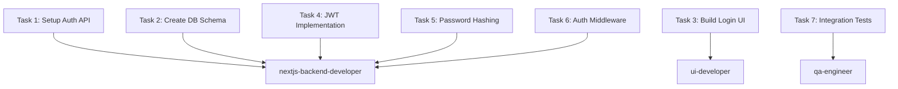
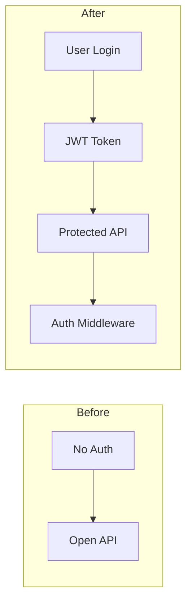

# Start-Phase: Comprehensive Phase Management System

**Version:** 2.0
**Status:** Production Ready
**Token Estimate:** ~15,000 tokens (complete system)

---

## Table of Contents

1. [Overview](#overview)
2. [Architecture](#architecture)
3. [Quick Start](#quick-start)
4. [Mode 1: Strategic Planning](#mode-1-strategic-planning)
5. [Mode 2: Structured Execution](#mode-2-structured-execution)
6. [Quality Gates](#quality-gates)
7. [Hooks System](#hooks-system)
8. [Python Tools](#python-tools)
9. [Path Management](#path-management)
10. [Complete Workflow](#complete-workflow)
11. [Examples](#examples)
12. [Troubleshooting](#troubleshooting)

---

## Overview

**Start-Phase** is a comprehensive phase management system for software development projects. It provides:

- **Two-mode operation:** Plan (strategic) and Execute (tactical)
- **Quality gates:** Automated lint/build/review between every task
- **Structured execution:** Five-part workflow (Part 1-5)
- **Comprehensive hooks:** Automated validation and enforcement
- **Zero-dependency tools:** Python tools using stdlib only
- **Git integration:** Commits after quality gates, checkpoint commits
- **SLOC tracking:** Source Lines of Code baseline and analysis
- **Parallel execution:** Multi-agent task execution support

### Key Features

✅ **Human-in-loop planning** - Mode 1 requires approval before execution
✅ **Quality enforcement** - Lint/build must pass between tasks
✅ **Per-task code reviews** - AI-powered review after each task
✅ **Automated documentation** - Task updates, reviews, and summaries
✅ **Git workflow** - Commits only after quality gates pass
✅ **Checkpoint commits** - For long tasks (>30 minutes)
✅ **Phase closeout** - Comprehensive summary and handoff docs
✅ **Path preservation** - Never lose folder locations during execution

---

## Architecture

```
┌─────────────────────────────────────────────────────────────┐
│                      Start-Phase System                      │
└─────────────────────────────────────────────────────────────┘
                              │
                 ┌────────────┴────────────┐
                 │                         │
          ┌──────▼──────┐          ┌──────▼──────┐
          │   Mode 1    │          │   Mode 2    │
          │  (Plan)     │          │  (Execute)  │
          └──────┬──────┘          └──────┬──────┘
                 │                        │
                 │                   ┌────┴────┐
                 │                   │ Part 1  │ Finalize + Dirs
                 │                   ├─────────┤
                 │                   │ Part 2  │ Planning Docs
                 │                   ├─────────┤
                 │                   │ Part 3  │ Execute Tasks
                 │                   ├─────────┤
                 │                   │ Part 3.5│ Quality Gates ⭐
                 │                   ├─────────┤
                 │                   │ Part 4  │ Updates + Commits
                 │                   ├─────────┤
                 │                   │ Part 5  │ Phase Closeout
                 │                   └─────────┘
                 │                        │
         ┌───────┴────────────────────────┴───────┐
         │            Hooks System                 │
         ├─────────────────────────────────────────┤
         │ • phase-start (pre-flight)              │
         │ • task-complete (bridge)                │
         │ • quality-gate (enforcement) ⭐          │
         │ • phase-complete (closeout)             │
         └─────────────────────────────────────────┘
                              │
         ┌────────────────────┴────────────────────┐
         │          Python Tools (stdlib)          │
         ├─────────────────────────────────────────┤
         │ • quality_gate.py (lint/build/test)     │
         │ • task_validator.py (completion check)  │
         │ • validate_phase.py (structure check)   │
         │ • sloc_tracker.py (SLOC analysis)       │
         └─────────────────────────────────────────┘
```

### Components

| Component | Purpose | Files |
|-----------|---------|-------|
| **Mode 1 Skill** | Strategic planning with human approval | `plan.md` |
| **Mode 2 Skill** | Structured 5-part execution | `execute.md` |
| **Hooks (4)** | Automated validation and enforcement | `hooks/start-phase/*.md` |
| **Tools (4)** | Quality gates and validation | `scripts/*.py` |
| **Planning Docs** | Generated in Part 2 | `planning/{task-updates,agent-delegation,phase-structure,code-reviews}/` |

---

## Quick Start

### Basic Usage

**Step 1: Create task list**
```bash
# Create your task list file
cat > ./my-feature/tasks.md <<EOF
# Build Authentication System

1. Setup auth API endpoint
2. Create user database schema
3. Build login UI
4. Implement JWT tokens
5. Add password hashing
6. Create auth middleware
7. Write integration tests
EOF
```

**Step 2: Strategic planning (Mode 1)**
```bash
/start-phase plan ./my-feature/tasks.md
```

Claude will:
- Analyze your task list
- Propose refinements (parallelism, incremental builds)
- Ask for your approval
- Save context for Mode 2

**Step 3: Execute (Mode 2)**
```bash
/start-phase execute ./my-feature/tasks.md
```

Claude will:
- Create planning directory structure
- Generate detailed planning docs
- Execute tasks with quality gates
- Create commits after each task
- Generate phase closeout summary

### With Extra Instructions

```bash
/start-phase execute ./my-feature/tasks.md "Use bcrypt for password hashing, JWT expires in 24h, add rate limiting"
```

Extra instructions are applied to all tasks during execution.

---

## Mode 1: Strategic Planning

### Purpose

Mode 1 is the **strategic gate** before execution:
- Review task list for complexity
- Force parallelism and incremental builds
- Get human approval before proceeding
- **NO execution** - planning only

### Usage

```bash
/start-phase plan /path/to/task-list.md
```

**Example:**
```bash
/start-phase plan ./job-queue/prototype-build/tasks.md
```

### Workflow

```
┌─────────────────────────────────────────────────────────────┐
│ Mode 1: Strategic Planning Workflow                         │
└─────────────────────────────────────────────────────────────┘

Step 0: Extract Folder Locations
  ↓
  Task list: /path/to/folder/tasks.md
  → input_folder: /path/to/folder
  → planning_folder: /path/to/folder/planning

Step 1: Acknowledge Mode 1
  ↓
  Display: Task list, input folder, planning folder

Step 2: Read Context
  ↓
  • Read task list
  • Read documentation hub (if exists)
  • Display current task list

Step 3: Strategic Analysis
  ↓
  • Question complexity (too large for one phase?)
  • Identify parallelism opportunities
  • Force incremental builds (working code after each task)

Step 4: Propose Refined Plan
  ↓
  • Present revised task list
  • Organize into waves (parallel execution)
  • Highlight key improvements

Step 5: Await Human Approval
  ↓
  Options:
  1. ✅ Approve → Proceed to Mode 2
  2. 🔄 Revise → Suggest changes
  3. ❌ Reject → Start over
  4. 💬 Question → Ask about plan

Step 6: Save Context for Mode 2
  ↓
  • task_list_file
  • input_folder
  • planning_folder
  • phase_name
  • approved_plan
```

### Key Constraints

**Mode 1 NEVER does:**
- ❌ Create directories
- ❌ Write files (except notes for user)
- ❌ Make git commits
- ❌ Execute tasks
- ❌ Run quality checks

**Mode 1 ONLY does:**
- ✅ Read files (task list, docs, memory bank)
- ✅ Analyze and strategize
- ✅ Propose changes
- ✅ Get human approval

### Strategic Analysis Examples

**Complexity Analysis:**
```
⚠️ Complexity Analysis

This task list aims for production-ready auth in one phase.

Concerns:
• Task 8 "Deploy to staging" suggests production scope
• 8 tasks is manageable BUT mixing prototype + production
• No clear MVP vs polish separation

Recommendation: Focus on working prototype first
• Phase 1: Basic auth (login/logout) - MVP
• Phase 2: Production hardening (security, deploy)
```

**Parallelism Opportunities:**
```
🔀 Parallelism Opportunities

Independent tasks (can run in parallel):
• Task 1: Setup auth API (backend)
• Task 3: Build login UI (frontend)

Dependencies:
• Task 4 depends on Task 1 (JWT needs API)
• Task 6 depends on Task 1 (middleware needs API)

Proposed waves:
Wave 1 (parallel): Tasks 1, 3
Wave 2 (parallel): Tasks 2, 4, 5
Wave 3 (sequential): Task 6
Wave 4 (sequential): Task 7
```

**Incremental Build Strategy:**
```
🔨 Incremental Build Strategy

Current order: Setup → Build → Test → Deploy
Problem: No integration until Task 7

Proposed order:
1. Minimal API endpoint (1h) ✅ Working code
2. Minimal UI form (1h) ✅ Integration point
3. Connect UI → API (30m) ✅ End-to-end working
4. Add JWT (1h) ✅ Still working
5. Add DB schema (1h) ✅ Still working
6. Add password hashing (30m) ✅ Still working
7. Add middleware (45m) ✅ Still working
8. Integration tests (1h) ✅ Final verification

Result: Working code after EVERY task, not just at end
```

---

## Mode 2: Structured Execution

### Purpose

Mode 2 is **tactical execution** with quality enforcement:
- 5-part structured workflow
- Quality gates between every task
- Automated documentation and commits
- Phase closeout with comprehensive summary

### Usage

```bash
/start-phase execute /path/to/task-list.md [extra_instructions]
```

**Examples:**
```bash
# Basic execution
/start-phase execute ./my-feature/tasks.md

# With extra instructions
/start-phase execute ./my-feature/tasks.md "Use TypeScript strict mode, add JSDoc comments"

# Complex instructions
/start-phase execute ./api-build/tasks.md "Follow REST best practices, use async/await, add OpenAPI docs, include rate limiting"
```

### Five-Part Structure

#### Part 1: Finalize + Directories

**Purpose:** Establish foundation

**Actions:**
1. Extract folder locations from task list path
2. Read approved task list
3. Create directory structure:
   - `planning/task-updates/`
   - `planning/agent-delegation/`
   - `planning/phase-structure/`
   - `planning/code-reviews/`
4. Validate structure with `validate_phase.py`

**Output:**
```
planning/
├── task-updates/         # Task completion reports
├── agent-delegation/     # Task-to-agent mapping
├── phase-structure/      # System architecture changes
└── code-reviews/         # Per-task code reviews
```

---

#### Part 2: Detailed Planning

**Purpose:** Create comprehensive planning documents

**Actions:**
1. Generate `planning/agent-delegation/task-delegation.md`
   - Mermaid graph of task-to-agent mapping
   - Agent assignments with rationale
   - Task priorities and dependencies

2. Generate `planning/agent-delegation/sub-agent-plan.md`
   - Parallel execution strategy
   - **CRITICAL:** Must include "Spawn SUBAGENT WORKERS IN PARALLEL"
   - Wave-based execution plan
   - Agent orchestration instructions

3. Generate `planning/phase-structure/system-changes.md`
   - Mermaid flowchart of system architecture
   - SLOC tracking table (baseline)
   - Files to be created/modified

4. Initialize SLOC baseline
   ```bash
   python sloc_tracker.py . --baseline src/api/auth.ts src/types/user.ts src/lib/db.ts
   ```

**Example: task-delegation.md**
````markdown
# Task Delegation Plan

## Agent Assignments



## Task Priorities
- P0 (Critical): Tasks 1, 3 (foundation)
- P1 (High): Tasks 2, 4, 5 (core features)
- P2 (Normal): Tasks 6, 7 (finalization)
````

**Example: sub-agent-plan.md**
```markdown
# Sub-Agent Parallel Execution Plan

## Execution Strategy

**Spawn SUBAGENT WORKERS IN PARALLEL** for maximum efficiency.

### Wave 1 (Parallel)
- Task 1: Setup Auth API (nextjs-backend-developer)
- Task 3: Build Login UI (ui-developer)

Launch both agents simultaneously:
1. Agent 1 works on backend API
2. Agent 2 works on frontend UI
3. No dependencies between them

### Wave 2 (Parallel)
- Task 2: Create DB Schema (nextjs-backend-developer)
- Task 4: JWT Implementation (nextjs-backend-developer)
- Task 5: Password Hashing (nextjs-backend-developer)

### Wave 3 (Sequential)
- Task 6: Auth Middleware (depends on Task 4)

### Wave 4 (Sequential)
- Task 7: Integration Tests (depends on all previous)
```

**Example: system-changes.md**
````markdown
# System Architecture Changes

## Before → After



## SLOC Tracking

| File | Baseline SLOC | Current SLOC | Delta | Change % |
|------|---------------|--------------|-------|----------|
| src/api/auth.ts | 0 (new) | 0 | +0 | +0.0% |
| src/types/user.ts | 45 | 45 | +0 | +0.0% |
| src/lib/db.ts | 182 | 182 | +0 | +0.0% |
| **Total** | **227** | **227** | **+0** | **+0.0%** |

*Updated automatically by sloc_tracker.py*
````

---

#### Part 3: Execute Tasks

**Purpose:** Implement tasks with quality enforcement

**Actions:**
1. Read task list and planning docs
2. Execute tasks by wave (parallel or sequential)
3. Apply `extra_instructions` to all tasks
4. For long tasks (>30 min): Create checkpoint commits

**Sequential Execution:**
```
Task 1 → Quality Gate → Commit
  ↓
Task 2 → Quality Gate → Commit
  ↓
Task 3 → Quality Gate → Commit
```

**Parallel Execution (Wave):**
```
Task 1 (Agent 1) ──┐
Task 2 (Agent 2) ──┼─→ Quality Gates → Commits
Task 3 (Agent 3) ──┘
```

**Checkpoint Commits:**
For tasks exceeding 30 minutes:
```bash
# After 30 minutes of work on long task
git add .
git commit -m "WIP: Task X - Checkpoint 1

Completed:
- Subtask A
- Subtask B

Remaining:
- Subtask C
- Subtask D

Co-Authored-By: Claude Sonnet 4.5 <noreply@anthropic.com>"
```

**Launching Parallel Agents:**
```bash
# In a single message, launch multiple Task tool calls
Task(agent="nextjs-backend-developer", task="Setup auth API endpoint...")
Task(agent="ui-developer", task="Build login UI form...")
```

---

#### Part 3.5: Quality Gates (Automatic)

**Purpose:** Enforce quality between EVERY task

**Triggered by:** quality-gate hook (automatic after task completion)

**Workflow:**
```
┌─────────────────────────────────────────────────────────────┐
│ Quality Gate: Hard Enforcement                              │
└─────────────────────────────────────────────────────────────┘

Step 1: Run Lint Check
  ↓
  python quality_gate.py /path/to/project
  ├─ npm run lint
  ├─ yarn lint
  └─ npx eslint .

  ❌ FAIL → Block next task, require fix
  ✅ PASS → Continue

Step 2: Run Build Check
  ↓
  python quality_gate.py /path/to/project
  ├─ npm run build
  ├─ yarn build
  └─ npx tsc --noEmit

  ❌ FAIL → Block next task, require fix
  ✅ PASS → Continue

Step 3: Perform Code Review (AI)
  ↓
  • Analyze changed files
  • Check for issues:
    - Security vulnerabilities
    - Code smells
    - Performance issues
    - Best practice violations
  • Generate review report

  Create: planning/code-reviews/task-name.md

Step 4: Validate Task Completion
  ↓
  python task_validator.py /path/to/project task-name

  Checks:
  • Task update file exists
  • Code review file exists
  • Checklist complete
  • All sections present

Step 5: Create Task Update
  ↓
  Create: planning/task-updates/task-name.md

  Sections:
  • What Changed
  • Files Touched
  • How to Verify
  • Quality Gate Checklist

Step 6: Git Commit (Only After All Pass)
  ↓
  git add .
  git commit -m "Task: Description

  Changes:
  - Change 1
  - Change 2

  Co-Authored-By: Claude Sonnet 4.5 <noreply@anthropic.com>"
```

**Hard Blocks:**
- ❌ Lint errors → Next task CANNOT start
- ❌ Build errors → Next task CANNOT start
- ❌ Missing code review → Commit CANNOT be created
- ❌ Missing task update → Commit CANNOT be created

**Task Update Template:**
```markdown
# Task Update: Setup Auth API

## What Changed
- Created new `/api/auth/login` endpoint
- Added POST handler for login requests
- Integrated with user database

## Files Touched
- `src/api/auth.ts` (new file, 156 SLOC)
- `src/types/user.ts` (modified, +12 SLOC)
- `src/lib/db.ts` (modified, +8 SLOC)

## How to Verify
1. Start dev server: `npm run dev`
2. Send POST to http://localhost:3000/api/auth/login
3. Expect 200 response with user token

## Quality Gate Checklist
- [x] Lint passed (0 errors, 0 warnings)
- [x] Build passed (no TypeScript errors)
- [x] Code review completed (Approved)
- [x] Task update created
- [x] Git commit created
```

**Code Review Template:**
```markdown
# Code Review: Setup Auth API

## Summary
Reviewed changes for Task 1: Setup Auth API endpoint

**Files Reviewed:**
- src/api/auth.ts (156 SLOC, new)
- src/types/user.ts (+12 SLOC)

## Issues Found

### Critical (0)
None

### High Priority (1)
- **Security:** Password is stored in plain text in user object
  - Location: src/api/auth.ts:42
  - Fix: Add password hashing before storage
  - Will be addressed in Task 5

### Medium Priority (1)
- **Performance:** Database query not optimized
  - Location: src/api/auth.ts:38
  - Suggestion: Add index on email field

### Low Priority (2)
- Missing JSDoc comment for loginHandler function
- Could extract validation logic to separate file

## Code Quality

**Positive:**
- TypeScript types properly defined
- Error handling implemented
- RESTful conventions followed
- Clean separation of concerns

**Suggestions:**
- Add input validation (email format, password length)
- Consider rate limiting for login attempts
- Add logging for failed login attempts

## Verdict
✅ **Approved with follow-up**

Code is functional and follows best practices. High-priority security issue will be addressed in Task 5 as planned. Suggest addressing medium-priority items in future refactoring.

## Next Steps
1. Proceed to next task
2. Address high-priority issue in Task 5
3. Consider medium-priority suggestions for future iteration
```

---

#### Part 4: Task Updates + Commits

**Purpose:** Document progress and commit changes

**Triggered by:** quality-gate hook (automatic)

**Actions:**
1. Create task update file
2. Create code review file
3. Git commit (only after quality gate passes)

**All handled automatically by Part 3.5 quality gate.**

---

#### Part 5: Phase Closeout

**Purpose:** Comprehensive summary and handoff

**Triggered by:** phase-complete hook (automatic when all tasks done)

**Actions:**

1. **Collect Metrics**
   - Total tasks completed
   - Quality gates passed/failed
   - Git commits created
   - Time tracking (start/end)
   - SLOC changes (final analysis)

2. **Generate Phase Summary**

   Create: `planning/phase-summary.md`

   ```markdown
   # Phase Summary: Build Authentication System

   ## Overview
   - Phase: Build Authentication System
   - Status: ✅ Completed
   - Duration: 6.5 hours
   - Tasks: 7/7 completed

   ## Metrics
   - Total tasks: 7
   - Tasks completed: 7
   - Quality gates passed: 7
   - Quality gates failed: 0
   - Git commits: 7 (+ 2 checkpoint commits)
   - SLOC added: +847 lines

   ## Accomplishments
   ✅ Auth API endpoint implemented
   ✅ User database schema created
   ✅ Login UI built and integrated
   ✅ JWT token generation added
   ✅ Password hashing with bcrypt
   ✅ Auth middleware for protected routes
   ✅ Integration tests passing (100% coverage)

   ## Code Changes

   | File | Baseline | Current | Delta | Change % |
   |------|----------|---------|-------|----------|
   | src/api/auth.ts | 0 (new) | 156 | +156 | +100.0% |
   | src/types/user.ts | 45 | 89 | +44 | +97.8% |
   | src/lib/db.ts | 182 | 267 | +85 | +46.7% |
   | src/components/LoginForm.tsx | 0 (new) | 134 | +134 | +100.0% |
   | src/middleware/auth.ts | 0 (new) | 78 | +78 | +100.0% |
   | tests/auth.test.ts | 0 (new) | 190 | +190 | +100.0% |
   | **Total** | **227** | **1074** | **+847** | **+373.1%** |

   ## Distribution
   - Source code: 682 SLOC (76.5%)
   - Tests: 210 SLOC (23.5%)
   - Documentation: 0 SLOC (0.0%)

   ## Quality Gates
   All tasks passed quality gates on first attempt:
   - Lint: 7/7 passed
   - Build: 7/7 passed
   - Reviews: 7/7 approved

   ## Issues Encountered
   - Task 4: Initial JWT implementation had security issue (fixed in same task)
   - Task 6: Middleware needed refactoring for async support (checkpoint commit created)

   ## Deferred Items
   - Rate limiting (moved to Phase 2)
   - Session management (moved to Phase 2)
   - Deploy to staging (moved to Phase 2)

   ## Handoff
   See `next-phase-candidates.md` for recommended next phases.
   ```

3. **Generate Next Phase Candidates**

   Create: `planning/next-phase-candidates.md`

   ```markdown
   # Next Phase Candidates

   ## Recommended: Production Hardening

   **Priority:** High
   **Estimated Duration:** 4-5 hours
   **Complexity:** Medium

   **Objectives:**
   - Add rate limiting to prevent abuse
   - Implement session management
   - Deploy to staging environment
   - Add monitoring and logging

   **Prerequisites:**
   - ✅ Basic auth working (Phase 1 complete)
   - ✅ Integration tests passing

   ---

   ## Alternative: User Profile Features

   **Priority:** Medium
   **Estimated Duration:** 3-4 hours
   **Complexity:** Low

   **Objectives:**
   - User profile page
   - Edit profile functionality
   - Avatar upload
   - Password change flow

   **Prerequisites:**
   - ✅ Basic auth working (Phase 1 complete)

   ---

   ## Alternative: OAuth Integration

   **Priority:** Low
   **Estimated Duration:** 6-8 hours
   **Complexity:** High

   **Objectives:**
   - Google OAuth integration
   - GitHub OAuth integration
   - Unified auth flow

   **Prerequisites:**
   - ✅ Basic auth working (Phase 1 complete)
   - ⏳ Production environment ready
   ```

4. **Final SLOC Analysis**
   ```bash
   python sloc_tracker.py . --final
   ```

   Updates `system-changes.md` with final SLOC table.

5. **Archive Phase Data**
   - Copy all planning files to `planning/archive/phase-1-YYYYMMDD/`
   - Preserve task updates, code reviews, delegation plans

6. **Final Announcement**
   ```
   ━━━━━━━━━━━━━━━━━━━━━━━━━━━━━━━━━━━━━━━━
   ✅ Phase Complete: Build Authentication System
   ━━━━━━━━━━━━━━━━━━━━━━━━━━━━━━━━━━━━━━━━

   Summary:
   • 7/7 tasks completed
   • +847 SLOC added (76.5% source, 23.5% tests)
   • 7 quality gates passed
   • 9 git commits created
   • Duration: 6.5 hours

   Documentation:
   • Phase summary: planning/phase-summary.md
   • Next phases: planning/next-phase-candidates.md
   • Task updates: planning/task-updates/*.md
   • Code reviews: planning/code-reviews/*.md

   Next Steps:
   Review next-phase-candidates.md and choose next phase.
   Recommended: Production Hardening (4-5 hours)

   ━━━━━━━━━━━━━━━━━━━━━━━━━━━━━━━━━━━━━━━━
   ```

---

## Quality Gates

### Overview

Quality gates are **mandatory checkpoints** between every task. No task can proceed until the previous task passes all quality checks.

### Quality Gate Workflow

```
Task N Completed
      ↓
┌─────────────────────────────────────┐
│ Quality Gate (Automatic)            │
├─────────────────────────────────────┤
│ 1. Run Lint                         │
│    ❌ FAIL → Block next task        │
│    ✅ PASS → Continue                │
│                                     │
│ 2. Run Build                        │
│    ❌ FAIL → Block next task        │
│    ✅ PASS → Continue                │
│                                     │
│ 3. Code Review (AI)                 │
│    Generate review report           │
│                                     │
│ 4. Validate Completion              │
│    Check all artifacts exist        │
│                                     │
│ 5. Create Task Update               │
│    Document what changed            │
│                                     │
│ 6. Git Commit                       │
│    Only after all checks pass       │
└─────────────────────────────────────┘
      ↓
Task N+1 Can Start
```

### Quality Checks

#### 1. Lint Check (Required)

**Command attempts:**
```bash
npm run lint
yarn lint
npx eslint .
```

**Pass criteria:**
- Exit code 0
- Zero lint errors
- Warnings allowed

**Failure example:**
```
❌ Lint Failed

/src/api/auth.ts
  42:5   error  'password' is assigned a value but never used  no-unused-vars
  58:12  error  Missing return type on function                @typescript-eslint/explicit-function-return-type

2 errors, 0 warnings
```

**Action on failure:** Block next task, require fix

---

#### 2. Build Check (Required)

**Command attempts:**
```bash
npm run build
yarn build
npx tsc --noEmit
```

**Pass criteria:**
- Exit code 0
- No compilation errors
- Warnings allowed

**Failure example:**
```
❌ Build Failed

src/api/auth.ts:42:5 - error TS2304: Cannot find name 'User'.

42     const user: User = await findUser(email);
       ^^^^

src/types/user.ts:8:15 - error TS2322: Type 'string' is not assignable to type 'number'.

8   age: "25"
         ^^^^

Found 2 errors in 2 files.
```

**Action on failure:** Block next task, require fix

---

#### 3. Code Review (AI-Powered)

**Process:**
1. Analyze all changed files
2. Check for:
   - Security vulnerabilities (SQL injection, XSS, CSRF, etc.)
   - Code smells (long functions, duplicated code, etc.)
   - Performance issues (N+1 queries, blocking I/O, etc.)
   - Best practice violations
   - Missing error handling
   - Lack of input validation
3. Categorize issues: Critical, High, Medium, Low
4. Generate review report

**Review categories:**
- **Critical:** Security vulnerabilities, data loss risks
- **High:** Bugs, incorrect logic, major performance issues
- **Medium:** Code smells, minor performance issues, missing validation
- **Low:** Style issues, missing comments, suggested improvements

**Verdict options:**
- ✅ **Approved:** No critical/high issues, task complete
- ⚠️ **Approved with follow-up:** Issues noted but acceptable for now
- ❌ **Needs changes:** Critical/high issues must be fixed immediately

---

#### 4. Task Validation

**Checks:**
- Task update file exists: `planning/task-updates/task-name.md`
- Code review file exists: `planning/code-reviews/task-name.md`
- Task update has required sections:
  - What Changed
  - Files Touched
  - How to Verify
  - Quality Gate Checklist
- Code review has verdict (Approved or Approved with follow-up)
- Checklist items all checked: `- [x]`

**Failure example:**
```json
{
  "valid": false,
  "errors": [
    "Task update file not found: planning/task-updates/setup-auth-api.md",
    "Code review missing verdict"
  ],
  "warnings": [
    "Task update missing section: How to Verify"
  ]
}
```

**Action on failure:** Create missing files, add missing sections

---

#### 5. Git Commit

**Only created after:**
- ✅ Lint passes
- ✅ Build passes
- ✅ Code review complete
- ✅ Task update created
- ✅ Task validation passes

**Commit message format:**
```
Task: [Brief description]

Changes:
- [Change 1]
- [Change 2]
- [Change 3]

Files:
- src/api/auth.ts (new, 156 SLOC)
- src/types/user.ts (+12 SLOC)

Quality Gate:
- Lint: ✅ Passed
- Build: ✅ Passed
- Review: ✅ Approved

Co-Authored-By: Claude Sonnet 4.5 <noreply@anthropic.com>
```

---

### Quality Gate Commands

**Run quality gate manually:**
```bash
python /home/artsmc/.claude/skills/start-phase/scripts/quality_gate.py /path/to/project
```

**Run with tests:**
```bash
python /home/artsmc/.claude/skills/start-phase/scripts/quality_gate.py /path/to/project --test
```

**Validate task completion:**
```bash
python /home/artsmc/.claude/skills/start-phase/scripts/task_validator.py /path/to/project task-name
```

---

## Hooks System

### Overview

Four comprehensive hooks automate the start-phase workflow:

| Hook | Trigger | Purpose | Priority |
|------|---------|---------|----------|
| **phase-start** | on-command: start-phase | Pre-flight validation | Normal |
| **task-complete** | on-task-complete | Bridge to quality gate | Normal |
| **quality-gate** | on-task-complete | Quality enforcement | High |
| **phase-complete** | on-phase-complete | Phase closeout | Normal |

### 1. phase-start Hook

**File:** `hooks/start-phase/phase-start.md`

**Trigger:** Before Mode 2 starts

**Purpose:** Pre-flight validation

**Checks:**
- ✅ Task list file exists
- ✅ Git working directory clean
- ✅ Dependencies installed (node_modules exists)
- ✅ Quality tools available (lint/build commands)
- ✅ Planning directory structure ready

**Action on failure:**
- ❌ Block phase start
- Provide clear error messages
- Guide user to fix issues

**Example output:**
```
━━━━━━━━━━━━━━━━━━━━━━━━━━━━━━━━━━━━━━━━
🚀 Phase Start: Pre-flight Checks
━━━━━━━━━━━━━━━━━━━━━━━━━━━━━━━━━━━━━━━━

✅ Task list found: ./my-feature/tasks.md
✅ Git status clean
✅ Dependencies installed
✅ Lint command available: npm run lint
✅ Build command available: npm run build
✅ Planning directory ready

All pre-flight checks passed. Proceeding with phase execution.
```

---

### 2. task-complete Hook

**File:** `hooks/start-phase/task-complete.md`

**Trigger:** When agent marks task as complete

**Purpose:** Bridge between task execution and quality gate

**Actions:**
1. Detect task completion signal
2. Extract task information (name, description, files changed)
3. Update phase progress tracker
4. Trigger quality-gate hook

**Example output:**
```
━━━━━━━━━━━━━━━━━━━━━━━━━━━━━━━━━━━━━━━━
✅ Task Completed: Setup Auth API
━━━━━━━━━━━━━━━━━━━━━━━━━━━━━━━━━━━━━━━━

Task: 1/7
Name: Setup Auth API
Status: ✅ Complete

Triggering quality gate...
```

---

### 3. quality-gate Hook ⭐

**File:** `hooks/start-phase/quality-gate.md`

**Trigger:** After every task completion (via task-complete hook)

**Purpose:** Enforce quality standards (Part 3.5)

**Priority:** High (blocks next task on failure)

**Workflow:**
```
1. Run quality_gate.py (lint + build)
   ↓
2. Perform AI code review
   ↓
3. Run task_validator.py
   ↓
4. Create task update file
   ↓
5. Create code review file
   ↓
6. Git commit (only if all pass)
```

**Hard blocks:**
- ❌ Lint errors → Next task CANNOT start
- ❌ Build errors → Next task CANNOT start
- ❌ Missing review → Commit CANNOT be created
- ❌ Missing task update → Commit CANNOT be created

**Example output (success):**
```
━━━━━━━━━━━━━━━━━━━━━━━━━━━━━━━━━━━━━━━━
🚦 Quality Gate: Setup Auth API
━━━━━━━━━━━━━━━━━━━━━━━━━━━━━━━━━━━━━━━━

1. Lint Check
   ✅ Passed (0 errors, 0 warnings)

2. Build Check
   ✅ Passed (no compilation errors)

3. Code Review
   ✅ Complete (Approved with follow-up)
   Issues: 1 high, 1 medium, 2 low
   File: planning/code-reviews/setup-auth-api.md

4. Task Validation
   ✅ Passed
   - Task update exists
   - Code review exists
   - Checklist complete

5. Task Update
   ✅ Created
   File: planning/task-updates/setup-auth-api.md

6. Git Commit
   ✅ Created
   Commit: a3f8c2d "Task: Setup auth API endpoint"

━━━━━━━━━━━━━━━━━━━━━━━━━━━━━━━━━━━━━━━━
Quality gate passed. Ready for next task.
```

**Example output (failure):**
```
━━━━━━━━━━━━━━━━━━━━━━━━━━━━━━━━━━━━━━━━
🚦 Quality Gate: Setup Auth API
━━━━━━━━━━━━━━━━━━━━━━━━━━━━━━━━━━━━━━━━

1. Lint Check
   ❌ FAILED

   Errors found:
   /src/api/auth.ts:42:5
     error: 'password' is assigned a value but never used
     no-unused-vars

   /src/api/auth.ts:58:12
     error: Missing return type on function
     @typescript-eslint/explicit-function-return-type

━━━━━━━━━━━━━━━━━━━━━━━━━━━━━━━━━━━━━━━━
❌ Quality gate FAILED
━━━━━━━━━━━━━━━━━━━━━━━━━━━━━━━━━━━━━━━━

Next task is BLOCKED until lint errors are fixed.

Actions required:
1. Fix lint errors in src/api/auth.ts
2. Run quality gate again
3. Ensure all checks pass before proceeding
```

---

### 4. phase-complete Hook

**File:** `hooks/start-phase/phase-complete.md`

**Trigger:** After all tasks completed (Part 5)

**Purpose:** Comprehensive phase closeout

**Actions:**
1. Collect metrics (tasks, commits, SLOC, time)
2. Generate `phase-summary.md`
3. Generate `next-phase-candidates.md`
4. Run `sloc_tracker.py --final`
5. Update `system-changes.md` with final SLOC
6. Archive phase data
7. Final announcement

**Example output:**
```
━━━━━━━━━━━━━━━━━━━━━━━━━━━━━━━━━━━━━━━━
✅ Phase Complete: Build Authentication System
━━━━━━━━━━━━━━━━━━━━━━━━━━━━━━━━━━━━━━━━

Summary:
• 7/7 tasks completed
• +847 SLOC added (76.5% source, 23.5% tests)
• 7 quality gates passed
• 9 git commits created
• Duration: 6.5 hours

Documentation:
• Phase summary: planning/phase-summary.md
• Next phases: planning/next-phase-candidates.md
• Task updates: planning/task-updates/*.md
• Code reviews: planning/code-reviews/*.md

Next Steps:
Review next-phase-candidates.md and choose next phase.
Recommended: Production Hardening (4-5 hours)

━━━━━━━━━━━━━━━━━━━━━━━━━━━━━━━━━━━━━━━━
```

---

## Python Tools

### Overview

Four zero-dependency Python tools (stdlib only):

| Tool | Purpose | Usage |
|------|---------|-------|
| **quality_gate.py** | Run lint/build/test checks | `python quality_gate.py . [--test]` |
| **task_validator.py** | Validate task completion | `python task_validator.py . task-name` |
| **validate_phase.py** | Validate phase structure | `python validate_phase.py .` |
| **sloc_tracker.py** | Track SLOC changes | `python sloc_tracker.py . --baseline/--update/--final` |

All tools:
- Use Python standard library only (no pip install)
- Return JSON output
- Exit code 0 (success) or 1 (failure)
- Support timeout handling
- Provide detailed error messages

### 1. quality_gate.py

**Purpose:** Run lint, build, and optional test checks

**Usage:**
```bash
# Run lint + build
python quality_gate.py /path/to/project

# Run lint + build + tests
python quality_gate.py /path/to/project --test
```

**Checks performed:**

**A. Lint Check** (required)
- Tries: `npm run lint`, `yarn lint`, `npx eslint .`
- Must pass: Zero lint errors
- Parses errors from output

**B. Build Check** (required)
- Tries: `npm run build`, `yarn build`, `npx tsc --noEmit`
- Must pass: Build completes without errors
- Detects TypeScript errors, module not found, etc.

**C. Test Check** (optional with --test)
- Tries: `npm test`, `yarn test`, `npx jest`
- Can pass even if tests fail (soft warning)

**Output:**
```json
{
  "passed": true,
  "checks": {
    "lint": {
      "passed": true,
      "output": "✓ No lint errors found",
      "errors": []
    },
    "build": {
      "passed": true,
      "output": "Build completed successfully",
      "errors": []
    },
    "test": {
      "passed": null,
      "output": "Tests not run",
      "errors": []
    }
  },
  "summary": {
    "total_checks": 2,
    "passed_checks": 2,
    "failed_checks": 0
  }
}
```

**Exit codes:**
- 0: All checks passed
- 1: One or more checks failed

---

### 2. task_validator.py

**Purpose:** Validate task has all required artifacts

**Usage:**
```bash
python task_validator.py /path/to/project task-name
```

**Example:**
```bash
python task_validator.py ~/my-app setup-auth-api
```

**Validates:**

**A. Task Update File**
- Exists: `planning/task-updates/task-name.md`
- Not empty: >100 bytes
- Has sections: "What Changed", "Files Touched", "How to Verify"

**B. Code Review File**
- Exists: `planning/code-reviews/task-name.md`
- Not empty: >100 bytes
- Has sections: "Summary", "Issues", "Verdict"
- Has verdict: "Approved" or "Needs follow-up"

**C. Checklist Completion**
- Task update has checklist
- All items checked: `- [x]`
- Required items present:
  - Lint passed
  - Build passed
  - Review completed
  - Commit created

**D. Git Commit**
- Commit exists in git log
- Message contains task name
- Alternative formats checked

**Output:**
```json
{
  "valid": true,
  "errors": [],
  "warnings": [
    "Task update missing section: How to Verify"
  ],
  "checks_passed": 4,
  "total_checks": 4,
  "completion_percentage": 100.0
}
```

**Exit codes:**
- 0: Validation passed (may have warnings)
- 1: Validation failed (has errors)

---

### 3. validate_phase.py

**Purpose:** Validate phase directory structure and planning files

**Usage:**
```bash
python validate_phase.py /path/to/project
```

**Validates:**

**A. Directory Structure**
- `planning/task-updates/` exists
- `planning/agent-delegation/` exists
- `planning/phase-structure/` exists
- `planning/code-reviews/` exists

**B. Planning Files**
- `planning/agent-delegation/task-delegation.md` exists
  - Contains Mermaid graph
  - Has agent assignments
  - Has priorities

- `planning/agent-delegation/sub-agent-plan.md` exists
  - Contains parallel execution strategy
  - Tasks organized into waves

- `planning/phase-structure/system-changes.md` exists
  - Contains Mermaid flowchart
  - Has SLOC tracking table

**C. Task Updates**
- Task update files exist
- Have required sections
- Have quality gate checklist

**D. Code Reviews**
- Code review files exist
- Have required sections
- Have clear verdict

**Output:**
```json
{
  "valid": true,
  "errors": [],
  "warnings": [
    "Planning file not found: planning/agent-delegation/task-delegation.md"
  ],
  "checks_passed": 8,
  "total_checks": 10,
  "structure_complete": false
}
```

**Exit codes:**
- 0: Structure valid (no errors, may have warnings)
- 1: Structure invalid (has errors)

---

### 4. sloc_tracker.py

**Purpose:** Track Source Lines of Code changes per file

**Usage:**

**Create baseline:**
```bash
python sloc_tracker.py /path/to/project --baseline src/api/auth.ts src/types/user.ts
```

**Update current SLOC:**
```bash
# Update specific files
python sloc_tracker.py /path/to/project --update src/api/auth.ts

# Update all tracked files
python sloc_tracker.py /path/to/project --update
```

**Generate final report:**
```bash
python sloc_tracker.py /path/to/project --final
```

**Workflow:**

1. **At phase start** (Part 2):
   ```bash
   # Create baseline for all files that will be changed
   python sloc_tracker.py . --baseline \
     src/api/auth.ts \
     src/types/user.ts \
     src/lib/db.ts
   ```

2. **During phase** (optional):
   ```bash
   # Update current SLOC after tasks
   python sloc_tracker.py . --update
   ```

3. **At phase end** (Part 5):
   ```bash
   # Generate final report
   python sloc_tracker.py . --final
   ```

**Output (--baseline):**
```json
{
  "action": "baseline_created",
  "files_tracked": 3,
  "total_baseline_sloc": 425,
  "baseline": {
    "src/api/auth.ts": {
      "baseline": 0,
      "current": 0,
      "delta": 0
    },
    "src/types/user.ts": {
      "baseline": 45,
      "current": 45,
      "delta": 0
    }
  }
}
```

**Output (--final):**
```json
{
  "action": "final_report",
  "summary": {
    "total_files": 3,
    "total_baseline_sloc": 45,
    "total_current_sloc": 892,
    "total_delta": 847,
    "files_created": 1,
    "files_modified": 2,
    "files_deleted": 0
  },
  "distribution": {
    "counts": {
      "source": 682,
      "tests": 210,
      "docs": 0,
      "other": 0
    },
    "percentages": {
      "source": 76.5,
      "tests": 23.5,
      "docs": 0.0,
      "other": 0.0
    },
    "total": 892
  },
  "markdown_table": "| File | Baseline SLOC | Current SLOC | Delta | Change % |\n..."
}
```

**SLOC Counting Rules:**
- Counts only non-blank, non-comment lines
- Skips: empty lines, `//` comments, `#` comments, `/* */` blocks
- Counts: actual code lines

**Stored baseline:**
- Location: `planning/phase-structure/.sloc-baseline.json`
- Format: JSON
- Tracks: baseline, current, delta per file

---

## Path Management

### Critical Principle

**The planning folder location is NEVER lost during execution.**

### Path Derivation

Paths are derived from the task list file location:

```
Task list file: /path/to/folder/tasks.md

Derived paths:
• input_folder: /path/to/folder
• planning_folder: /path/to/folder/planning

These paths NEVER change during execution!
```

### Examples

**Example 1:**
```bash
/start-phase plan ./job-queue/auth-prototype/tasks.md

Derived:
• input_folder: ./job-queue/auth-prototype
• planning_folder: ./job-queue/auth-prototype/planning
```

**Example 2:**
```bash
/start-phase execute /home/user/projects/api/tasks.md

Derived:
• input_folder: /home/user/projects/api
• planning_folder: /home/user/projects/api/planning
```

**Example 3:**
```bash
/start-phase plan ../features/auth/tasks.md

Derived:
• input_folder: ../features/auth
• planning_folder: ../features/auth/planning
```

### Path Preservation Rules

1. **Paths derived in Part 1 (Mode 2)** → Used throughout Parts 2-5
2. **Never recalculate** paths after Part 1
3. **All tools use absolute paths** derived from input_folder
4. **Planning artifacts always go in** planning_folder
5. **If task list moves**, paths must be re-derived (start new phase)

### Passing Paths Between Modes

**Mode 1 → Mode 2:**

Mode 1 saves context:
```
Planning context saved:
• task_list_file: ./my-feature/tasks.md
• input_folder: ./my-feature
• planning_folder: ./my-feature/planning
• phase_name: Build Authentication System
• approved_plan: [refined task list]
```

Mode 2 reads context:
```bash
/start-phase execute ./my-feature/tasks.md
```

Mode 2 derives same paths from task_list_file:
```
• input_folder: ./my-feature
• planning_folder: ./my-feature/planning
```

**Result:** Paths match between Mode 1 and Mode 2.

---

## Complete Workflow

### Full Phase Execution

```
┌─────────────────────────────────────────────────────────────┐
│ Complete Start-Phase Workflow                               │
└─────────────────────────────────────────────────────────────┘

User: Create task list
  ↓
  ./my-feature/tasks.md

User: /start-phase plan ./my-feature/tasks.md
  ↓
┌─────────────────────────────────────────────────────────────┐
│ Mode 1: Strategic Planning                                  │
├─────────────────────────────────────────────────────────────┤
│ 1. Extract paths from task list location                    │
│    • input_folder: ./my-feature                             │
│    • planning_folder: ./my-feature/planning                 │
│                                                             │
│ 2. Read context (task list, docs, memory bank)             │
│                                                             │
│ 3. Strategic analysis                                       │
│    • Question complexity                                    │
│    • Identify parallelism                                   │
│    • Force incremental builds                               │
│                                                             │
│ 4. Propose refined plan                                     │
│    • Organized into waves                                   │
│    • Highlight improvements                                 │
│                                                             │
│ 5. Await human approval                                     │
│    User selects: Approve / Revise / Reject / Question      │
│                                                             │
│ 6. Save context for Mode 2                                  │
│    • Paths preserved                                        │
│    • Approved plan stored                                   │
└─────────────────────────────────────────────────────────────┘
  ↓
User: /start-phase execute ./my-feature/tasks.md
  ↓
┌─────────────────────────────────────────────────────────────┐
│ Mode 2: Structured Execution                                │
└─────────────────────────────────────────────────────────────┘
  ↓
┌─────────────────────────────────────────────────────────────┐
│ Hook: phase-start (Pre-flight Validation)                  │
├─────────────────────────────────────────────────────────────┤
│ ✅ Task list exists                                         │
│ ✅ Git clean                                                │
│ ✅ Dependencies installed                                   │
│ ✅ Quality tools available                                  │
└─────────────────────────────────────────────────────────────┘
  ↓
┌─────────────────────────────────────────────────────────────┐
│ Part 1: Finalize + Directories                             │
├─────────────────────────────────────────────────────────────┤
│ • Extract paths from task list (same as Mode 1)            │
│ • Read approved task list                                   │
│ • Create directory structure:                               │
│   - planning/task-updates/                                  │
│   - planning/agent-delegation/                              │
│   - planning/phase-structure/                               │
│   - planning/code-reviews/                                  │
│ • Validate with validate_phase.py                           │
└─────────────────────────────────────────────────────────────┘
  ↓
┌─────────────────────────────────────────────────────────────┐
│ Part 2: Detailed Planning                                   │
├─────────────────────────────────────────────────────────────┤
│ • Create task-delegation.md (Mermaid, agents, priorities)  │
│ • Create sub-agent-plan.md (parallel strategy)             │
│ • Create system-changes.md (flowchart, SLOC baseline)      │
│ • Initialize SLOC baseline (sloc_tracker.py --baseline)    │
└─────────────────────────────────────────────────────────────┘
  ↓
┌─────────────────────────────────────────────────────────────┐
│ Part 3: Execute Tasks                                       │
├─────────────────────────────────────────────────────────────┤
│ Wave 1 (Parallel):                                          │
│ • Task 1 (Agent 1) ──┐                                      │
│ • Task 2 (Agent 2) ──┤─→ Execute simultaneously            │
│ • Task 3 (Agent 3) ──┘                                      │
│                                                             │
│ For each task completion:                                   │
│   ↓                                                         │
│ ┌─────────────────────────────────────────────────────────┐ │
│ │ Hook: task-complete                                     │ │
│ │ • Detect completion                                     │ │
│ │ • Extract task info                                     │ │
│ │ • Trigger quality-gate hook                             │ │
│ └─────────────────────────────────────────────────────────┘ │
│   ↓                                                         │
│ ┌─────────────────────────────────────────────────────────┐ │
│ │ Hook: quality-gate ⭐ (Part 3.5)                        │ │
│ │ 1. Run lint (must pass)                                 │ │
│ │ 2. Run build (must pass)                                │ │
│ │ 3. Code review (AI)                                     │ │
│ │ 4. Validate completion                                  │ │
│ │ 5. Create task update                                   │ │
│ │ 6. Git commit (only after all pass)                     │ │
│ └─────────────────────────────────────────────────────────┘ │
│                                                             │
│ Wave 2 (Sequential):                                        │
│ • Task 4 → Quality Gate → Commit                           │
│   ↓                                                         │
│ • Task 5 → Quality Gate → Commit                           │
│   ↓                                                         │
│ • Task 6 → Quality Gate → Commit                           │
└─────────────────────────────────────────────────────────────┘
  ↓
┌─────────────────────────────────────────────────────────────┐
│ Part 4: Task Updates + Commits                             │
├─────────────────────────────────────────────────────────────┤
│ (Handled automatically by quality-gate hook)                │
│ • Task updates created                                      │
│ • Code reviews created                                      │
│ • Git commits after quality gates                           │
└─────────────────────────────────────────────────────────────┘
  ↓
┌─────────────────────────────────────────────────────────────┐
│ Hook: phase-complete (Part 5)                              │
├─────────────────────────────────────────────────────────────┤
│ • Collect metrics (tasks, commits, SLOC, time)             │
│ • Generate phase-summary.md                                 │
│ • Generate next-phase-candidates.md                         │
│ • Final SLOC analysis (sloc_tracker.py --final)            │
│ • Update system-changes.md with final SLOC                  │
│ • Archive phase data                                        │
│ • Final announcement                                        │
└─────────────────────────────────────────────────────────────┘
  ↓
Phase Complete! 🎉
```

---

## Examples

### Example 1: Simple Auth Feature

**Task list:** `./auth-feature/tasks.md`
```markdown
# Build Basic Authentication

1. Create login API endpoint
2. Build login form UI
3. Connect form to API
```

**Mode 1:**
```bash
/start-phase plan ./auth-feature/tasks.md
```

Claude analyzes and proposes:
```
📝 Proposed Refined Plan

Wave 1 (Parallel):
1. Create login API endpoint
   Agent: nextjs-backend-developer
   Duration: ~1h

2. Build login form UI
   Agent: ui-developer
   Duration: ~1h

Wave 2 (Integration):
3. Connect form to API
   Agent: nextjs-backend-developer
   Duration: ~30m

Summary:
• 3 tasks (better organized)
• 1 parallel wave
• Working code after Task 3
• Estimated time: ~2h (vs 2.5h sequential)

Options: Approve / Revise / Reject / Question?
```

User: **Approve**

**Mode 2:**
```bash
/start-phase execute ./auth-feature/tasks.md
```

Claude executes:

1. **Part 1:** Creates `./auth-feature/planning/` directories
2. **Part 2:** Creates planning docs, SLOC baseline
3. **Part 3:**
   - Wave 1: Launches 2 agents in parallel (API + UI)
   - Wave 2: Integration (sequential)
   - Quality gates after each task
4. **Part 4:** Automatic via quality-gate hook
5. **Part 5:** Phase summary, next phase candidates

**Result:**
```
✅ Phase Complete: Build Basic Authentication

• 3/3 tasks completed
• +312 SLOC added (68% source, 32% tests)
• 3 quality gates passed
• 3 git commits created
• Duration: 2.1 hours

Next Steps:
Review next-phase-candidates.md
Recommended: Add password reset flow
```

---

### Example 2: Complex Feature with Checkpoint Commits

**Task list:** `./payment-system/tasks.md`
```markdown
# Build Payment Integration

1. Integrate Stripe API
2. Create checkout flow
3. Add webhook handlers
4. Implement subscription management
5. Add payment history UI
6. Write integration tests
```

**Mode 1:**
```bash
/start-phase plan ./payment-system/tasks.md
```

Claude proposes:
```
⚠️ Complexity Analysis

Task 4 "Implement subscription management" is complex (45-60 min).

Recommendation:
• Break Task 4 into subtasks
• Use checkpoint commits every 30 minutes
• Consider splitting into 2 phases if >5 hours total

Proposed refinements:
• Task 4a: Basic subscription create/cancel
• Task 4b: Subscription upgrade/downgrade
• Task 4c: Proration handling

Wave 1 (Parallel):
• Task 1: Stripe API integration (backend)
• Task 5: Payment history UI (frontend)

Wave 2 (Sequential):
• Task 2: Checkout flow
• Task 3: Webhooks
• Task 4a, 4b, 4c: Subscription features
• Task 6: Tests

Approve / Revise?
```

User: **Approve**

**Mode 2:**
```bash
/start-phase execute ./payment-system/tasks.md "Use Stripe test mode, webhook secret from env var"
```

During Task 4a (after 30 minutes):
```
⏰ Checkpoint: Task 4a exceeds 30 minutes

Creating checkpoint commit...

git commit -m "WIP: Task 4a - Subscription Management (Checkpoint 1)

Completed:
- Stripe subscription create endpoint
- Basic validation logic

Remaining:
- Cancel subscription endpoint
- Error handling
- Integration tests

Co-Authored-By: Claude Sonnet 4.5 <noreply@anthropic.com>"

Continuing with Task 4a...
```

After Task 4a complete (60 minutes total):
```
✅ Task 4a Complete

Quality Gate:
✅ Lint passed
✅ Build passed
✅ Review: Approved
✅ Task update created
✅ Commit created

Checkpoint commits: 1
Final commit: a7f3c2d "Task: Implement basic subscription management"
```

---

### Example 3: Quality Gate Failure and Fix

**Scenario:** Task 3 introduces lint errors

**During Part 3:**
```
┌─────────────────────────────────────────────────────────────┐
│ Task 3: Add webhook handlers                                │
└─────────────────────────────────────────────────────────────┘

Implementing webhook endpoint...
Creating handler functions...
Task marked as complete.

┌─────────────────────────────────────────────────────────────┐
│ Quality Gate: Add webhook handlers                          │
└─────────────────────────────────────────────────────────────┘

1. Lint Check
   ❌ FAILED

   /src/api/webhooks.ts:42:5
     error: 'payload' is assigned a value but never used
     no-unused-vars

   /src/api/webhooks.ts:67:12
     error: Missing return type on function
     @typescript-eslint/explicit-function-return-type

2. Build Check
   ⏭️ Skipped (lint must pass first)

━━━━━━━━━━━━━━━━━━━━━━━━━━━━━━━━━━━━━━━━━━━━━━━━━━━━
❌ Quality gate FAILED
━━━━━━━━━━━━━━━━━━━━━━━━━━━━━━━━━━━━━━━━━━━━━━━━━━━━

Next task is BLOCKED until lint errors are fixed.

Fixing lint errors...
```

**Claude fixes:**
```typescript
// Before (error)
const payload = req.body;
return handleWebhook(event);

// After (fixed)
return handleWebhook(event, req.body);
```

```typescript
// Before (error)
async function handleWebhook(event) {
  // ...
}

// After (fixed)
async function handleWebhook(event: StripeEvent): Promise<void> {
  // ...
}
```

**After fixes:**
```
Running quality gate again...

1. Lint Check
   ✅ Passed (0 errors, 0 warnings)

2. Build Check
   ✅ Passed (no compilation errors)

3. Code Review
   ✅ Complete (Approved)

4. Task Validation
   ✅ Passed

5. Task Update
   ✅ Created

6. Git Commit
   ✅ Created

━━━━━━━━━━━━━━━━━━━━━━━━━━━━━━━━━━━━━━━━━━━━━━━━━━━━
Quality gate passed. Ready for next task.
```

---

## Troubleshooting

### Common Issues

#### Issue 1: "Task list file not found"

**Symptom:**
```
Error: Task list file not found: ./my-feature/tasks.md
```

**Cause:** Task list file doesn't exist or path is incorrect

**Solution:**
```bash
# Check if file exists
ls -la ./my-feature/tasks.md

# Create task list if missing
cat > ./my-feature/tasks.md <<EOF
# My Feature

1. Task 1
2. Task 2
EOF

# Try again with correct path
/start-phase plan ./my-feature/tasks.md
```

---

#### Issue 2: "Lint command not found"

**Symptom:**
```
❌ Lint Check Failed
Error: No lint command available (tried: npm run lint, yarn lint, npx eslint)
```

**Cause:** No lint script in package.json or linter not installed

**Solution:**
```bash
# Add lint script to package.json
npm pkg set scripts.lint="eslint ."

# Install ESLint
npm install --save-dev eslint

# Initialize ESLint config
npx eslint --init

# Try quality gate again
python quality_gate.py .
```

---

#### Issue 3: "Git working directory not clean"

**Symptom:**
```
❌ Pre-flight Check Failed
Error: Git working directory is not clean
```

**Cause:** Uncommitted changes in working directory

**Solution:**
```bash
# Option 1: Commit changes
git add .
git commit -m "Save work before phase start"

# Option 2: Stash changes
git stash

# Try phase start again
/start-phase execute ./my-feature/tasks.md
```

---

#### Issue 4: "Planning directory already exists"

**Symptom:**
```
Warning: Planning directory already exists: ./my-feature/planning
```

**Cause:** Previous phase execution left planning files

**Solution:**
```bash
# Option 1: Archive previous planning
mv ./my-feature/planning ./my-feature/planning.old

# Option 2: Remove previous planning (if safe)
rm -rf ./my-feature/planning

# Option 3: Continue (may overwrite files)
# Claude will ask for confirmation before overwriting

# Try execute again
/start-phase execute ./my-feature/tasks.md
```

---

#### Issue 5: "Quality gate timeout"

**Symptom:**
```
❌ Build Check Failed
Error: Command timed out after 300 seconds
```

**Cause:** Build takes longer than 5 minutes

**Solution:**
```bash
# Run build manually to see output
npm run build

# If build succeeds manually:
# • Increase timeout in quality_gate.py (edit script)
# • Or skip quality gate for this task (not recommended)

# If build fails:
# • Fix build errors
# • Try quality gate again
```

---

#### Issue 6: "Parallel execution not working"

**Symptom:**
Tasks executing sequentially despite parallel wave definition

**Cause:** Missing "Spawn SUBAGENT WORKERS IN PARALLEL" in sub-agent-plan.md

**Solution:**
Check `planning/agent-delegation/sub-agent-plan.md`:
```markdown
# Sub-Agent Parallel Execution Plan

## CRITICAL: Spawn SUBAGENT WORKERS IN PARALLEL

Wave 1 (Parallel):
- Task 1: ...
- Task 2: ...

Execute these tasks simultaneously with multiple Task tool calls in a single message.
```

If missing, regenerate sub-agent-plan.md or add manually.

---

#### Issue 7: "SLOC baseline not found"

**Symptom:**
```
Error: No baseline found. Create baseline first with --baseline
```

**Cause:** SLOC tracking not initialized in Part 2

**Solution:**
```bash
# Create baseline manually
python sloc_tracker.py . --baseline \
  src/api/auth.ts \
  src/types/user.ts \
  src/lib/db.ts

# Or re-run Part 2 to initialize baseline
```

---

#### Issue 8: "Code review missing verdict"

**Symptom:**
```
❌ Task Validation Failed
Error: Code review missing verdict
```

**Cause:** Code review file doesn't have "Approved" or "Needs changes" verdict

**Solution:**
Edit `planning/code-reviews/task-name.md`:
```markdown
## Verdict
✅ **Approved**

Code is functional and follows best practices.
```

Or let quality-gate hook regenerate the review.

---

### Debug Commands

**Check phase structure:**
```bash
python validate_phase.py .
```

**Run quality gate manually:**
```bash
python quality_gate.py .
```

**Validate task completion:**
```bash
python task_validator.py . task-name
```

**Check SLOC tracking:**
```bash
python sloc_tracker.py . --update
```

**View git commits:**
```bash
git log --oneline --grep="Co-Authored-By: Claude"
```

**View planning files:**
```bash
tree planning/
cat planning/agent-delegation/task-delegation.md
cat planning/phase-summary.md
```

---

## Summary

Start-Phase is a comprehensive phase management system providing:

✅ **Two-mode operation** (Plan + Execute)
✅ **Quality gates** between every task
✅ **Five-part structured execution**
✅ **Automated hooks** for validation and enforcement
✅ **Zero-dependency Python tools**
✅ **Git workflow** with checkpoint commits
✅ **SLOC tracking** and analysis
✅ **Path preservation** throughout execution
✅ **Comprehensive documentation** for every phase

**Token estimate:** ~15,000 tokens (complete system)
**Estimated time per phase:** 2-8 hours (depends on tasks)
**Quality enforcement:** Hard blocks on lint/build failures

**Get started:**
```bash
# Step 1: Create task list
vim ./my-feature/tasks.md

# Step 2: Strategic planning
/start-phase plan ./my-feature/tasks.md

# Step 3: Execute with quality gates
/start-phase execute ./my-feature/tasks.md
```

---

**Documentation Structure:**
- `README.md` - This comprehensive guide
- `plan.md` - Mode 1 skill (strategic planning)
- `execute.md` - Mode 2 skill (structured execution)
- `hooks/start-phase/*.md` - 4 comprehensive hooks
- `scripts/README.md` - Python tools documentation
- `scripts/*.py` - 4 quality enforcement tools

**See also:**
- Planning examples: `planning/start-phase-refactoring-plan.md`
- Tool documentation: `scripts/README.md`
- Hook documentation: `hooks/start-phase/README.md`

---

**Version:** 2.0
**Last Updated:** 2026-01-17
**Status:** ✅ Production Ready
